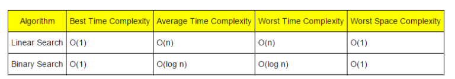
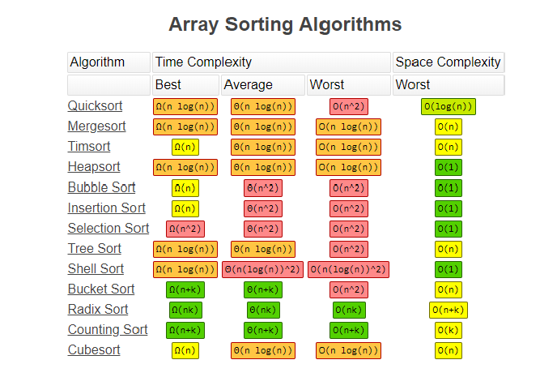

### Different type of searching and sorting algorithm - Implementation

Searching
------------------------------------------------------

- ***`Linear Search`*** [Ref](https://www.geeksforgeeks.org/binary-search/)=>
    - Implementation
    - https://github.com/sughosneo/dsalgo/blob/master/src/searching/LinearSearch.py 

- ***`Binary Search`*** [Ref](https://www.geeksforgeeks.org/binary-search/) =>
    - Implementation
    - https://github.com/sughosneo/dsalgo/blob/master/src/searching/BinarySearch.py

- ***`Complexity Table`***        

Sorting
------------------------------------------------------

- ***`Bubble Sort`*** [Ref](https://www.geeksforgeeks.org/binary-search/)=>
    - Implementation 
    - https://github.com/sughosneo/dsalgo/tree/master/src/sorting
    
    
- ***`Insertion Sort`*** [Ref](https://www.hackerearth.com/practice/algorithms/sorting/insertion-sort/tutorial/)=>
    - Implementation
    - https://github.com/sughosneo/dsalgo/blob/master/src/sorting/InsertionSort.py
    
- ***`Merge Sort`*** [Ref](https://www.geeksforgeeks.org/merge-sort/)=>
    - Implementation
    - https://github.com/sughosneo/dsalgo/blob/master/src/sorting/MergeSort.py
    
- ***`Quick Sort`*** [Ref](https://www.geeksforgeeks.org/quick-sort/)=>
    - Implementation 
    - https://github.com/sughosneo/dsalgo/blob/master/src/sorting/QuickSort.py  

- ***`Tim Sort`*** [Ref](https://hackernoon.com/timsort-the-fastest-sorting-algorithm-youve-never-heard-of-36b28417f399):
    - Implementation   

- ***`Is there any sorting algorithm of O(n) ?`***
    - https://www.youtube.com/watch?v=4Q72kbwyEmk  
    
   ***`Complexity Table`***
    
   

**`References`** :

http://bigocheatsheet.com/