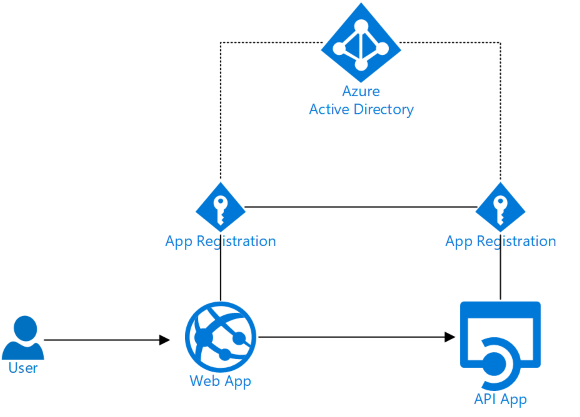
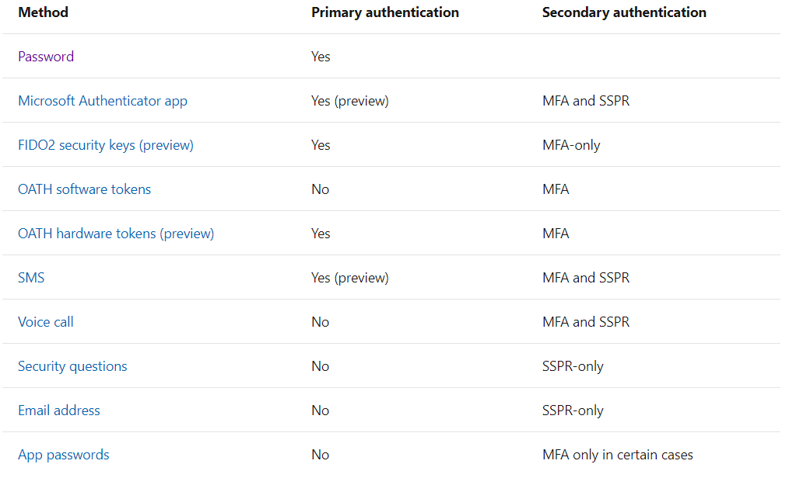
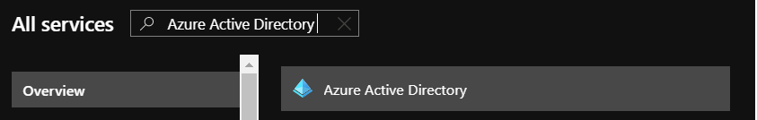
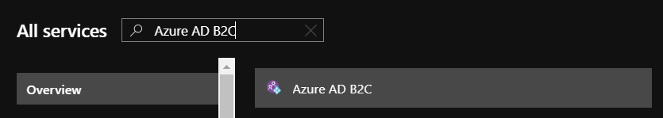
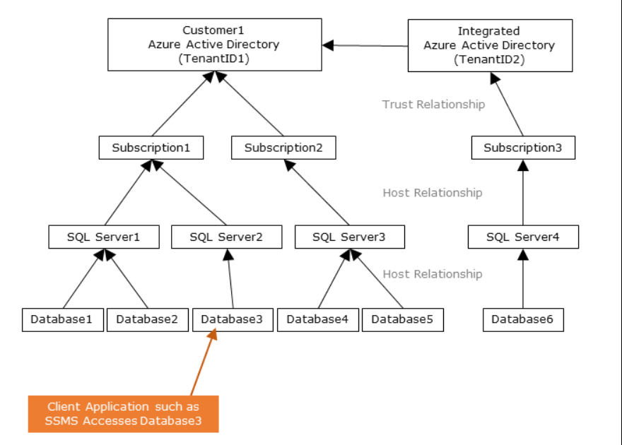
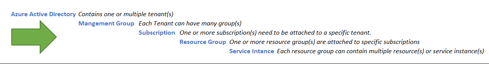
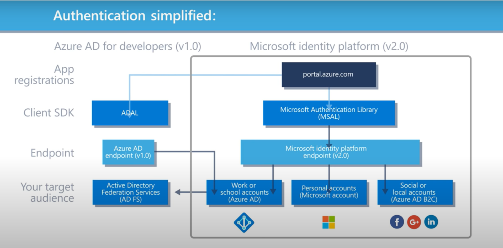

## 15 essential "Q&A" on Azure Active Directory

I have seen many confusion around [Azure Active Directory](https://docs.microsoft.com/en-us/azure/active-directory/) service and its offerings. Sometimes as a beginner it's too much of information for you to digest. And I am no different than that. So thought of writing this article more like an interactive Q&A format for all developers in their pursuit of references.

### ```1. What is Azure Active Directory not ?```

There is a misconception that, as the name suggest **Azure Active Directory (Aka Azure AD)** is the cloud version of on premise Active Directory. Although it performs similar functionalities but it's quite different. 

### ```2. What is Azure Active Directory then ?```

As per Microsoft documentation - *"Azure Active Directory (Azure AD) is a multi-tenant, cloud-based identity and access management service"*. In modern application development landscape it acts as an independent Identity provider for both client and server. 




*Source : Azure Blog*

Azure AD is primarily an identity solution, and it is designed for Internet-based applications by using HTTP (port 80) and HTTPS (port 443) communications.

#### 3. What are the supported protocol(s) by Azure Active Directory ?

Azure Active Directory is designed from scratch for the SaaS world. It supports protocols like [OpenID Connect](https://openid.net/connect/), [OAuth 2.0](https://oauth.net/2/), [SAML](https://en.wikipedia.org/wiki/Security_Assertion_Markup_Language) to provide SSO and [WS-Federation](https://medium.com/@robert.broeckelmann/understanding-ws-federation-passive-protocol-3f9dc2175b4f). Authentication protocol related detailed Q&A can be referred in [here](https://docs.microsoft.com/en-us/answers/topics/azure-ad-authentication-protocols.html). 


#### 4. What are the different authentication and verification methods available in Azure Active Directory?

Summary can be viewed in below mentioned table.




*Source : https://docs.microsoft.com/en-us/azure/active-directory/authentication/concept-authentication-methods*


#### 5. What are the differences between "On Premise Active Directory"  Vs  "Azure Active Directory" ?


| On Premise AD                                                                      | Azure AD                                                                                                                                                                                                              |
|------------------------------------------------------------------------------------|-----------------------------------------------------------------------------------------------------------------------------------------------------------------------------------------------------------------------|
| It's domain service based solution for on premise related resources.               | It's cloud based multi-tenant enabled Identity management solution.                                                                                                                                                   |
| It provide services for **Authentication** and **Rights management** for users and groups. | It provides **Services Identity** and **Access management** for different users and groups.                                                                                                                                   |
| It uses **Kerberos** or **NTLM** protocol for Authentication.                              | It's uses **OpenID connect** Authentication and **oAuth2** for Authorization.                                                                                                                                                 |
| It's uses **LDAP** protocol for communication.                                         | It cannot be queried through **LDAP**. Instead it uses the **REST API** over **HTTP** and **HTTPS**.                                                                                                                                  |
| **Domain services** is part of core offerings.                                         | For the cloud only organization it lets you create domain services in case if you want to set up Kerberos or NTLM auth for the your domain joined VMs. **Azure Active Directory Domain Services** is a separate offering. |


#### 6. Are Azure AD B2B and Azure AD B2C services same ?

Well, if you search on Azure Portal then it's not.







Azure AD B2C is ***"Identity and access management for your customer-facing apps"*** Let's say if you are planning to build one huge multitenant based product where different customers from different Tenant can be logged in into your Product without being a partner of your organization. That scenario B2C is the perfect fit. A good read is [here](https://medium.com/@taithienbo/azure-ad-b2b-vs-azure-ad-b2c-679b29bb0130#:~:text=Essentially%20it%20comes%20down%20to,providers%2C%20then%20use%20ADD%20B2C). 


#### 7. Does that mean external users can't even collaborate in Azure AD B2B model ?

External guest or partner users can collaborate with your organization with help of Azure AD B2B. Even different  services and applications of an organization can be shared with those invited users. It's worth reading it from [here](https://docs.microsoft.com/en-us/azure/active-directory/b2b/what-is-b2b) 


#### 8. Can user of one Tenant interact with services of other Tenant ?

Trust relationships can be setup between 2 Azure Active Directory Tenants and user of Tenant can access through Azure AD to use services from one other. 

For e.g. In below diagram user of TenantID2 can access SQL Server 1 or SQL Server 2.



***Source : Internet*** 

#### 9. What does these services mean to you if you are coming from AWS background ?

For,  
	***AWS*** Identity and Access Management (IAM) = ***Azure*** Active Directory + Role Based Access Control
	***AWS*** Cognito = ***Azure*** Active Directory B2C

More detailed can be found in here.


#### 10. What's the relationship Azure AD has with different Azure components ?

***Azure Active Directory*** is one most crucial service in entire Azure platform. Be it's a managed service instance in azure or your custom developed app hosted in azure, it interacts with Azure AD in way or other. By design it's starting point for one or more tenant set up in Azure platform. Overall relationship can be visualized as per below.





#### 11. Can I use Azure AD service for free ?

As this seems to be the **first** and **must have** feature for anyone to use in Azure. Does that mean can user use this for free ? Well, to a certain extend you can use this service for **Free**. But it has additional feature for **"Premium P1"** and **P2** licenses along with **"Pay-as-you-go"**. More detail can be found in [here](https://docs.microsoft.com/en-us/azure/active-directory/fundamentals/active-directory-whatis#what-are-the-azure-ad-licenses).


#### 12. In what type of Organizations Azure Active Directory can be used ?

***a. "Cloud Only" Organization :*** 

With cloud revolutions few of the organizations are born on cloud and they don't have any on premise infrastructure. For such scenarios everything has been controlled by Azure Active Directory. Be its Domain Services or Authentications or even Role based access management for individual user or user groups. 

***b. "Migrated To Cloud" Organization :***

Many organizations has already migrated to Azure Cloud from there on premise infra structure to leverage modern cloud service related capabilities. In such scenarios on premise AD user gets synced to cloud as Identity object using [Azure AD Connect](https://docs.microsoft.com/en-us/azure/active-directory/hybrid/whatis-azure-ad-connect) mechanism. This helps user to use same credential to login to Azure Portal for use their organization specific resources under allocated subscription. This is applicable for hybrid approaches as well.


#### 13. What are the different usage of Azure Active Directory ?

Though details can be found out in [here](https://docs.microsoft.com/en-us/azure/active-directory/fundamentals/active-directory-whatis#which-features-work-in-azure-ad). But when I look at Azure AD specific usage, I primarily see 4 different broad categories. 

***a. Existing Infra Structure  :*** 

In any infra structure in any Azure cloud enabled organization Azure Active Directory would be the obvious choice. This can be applicable within single tenant or in multiple tenant.

*For e.g. - Authenticating users through Azure AD in domain Joined VM.*

***b. Using Azure Managed Services :***

Users authentications or authorization for many Azure Managed Services can be handled using Azure AD.

*For e.g. - Azure SQL or Azure SQL Managed Instance.*

***c. Custom Apps within the Organization :***

Custom developed app which are used within Organization for internal purpose, can be enabled with Azure AD authentication or Azure AD federated with Active Directory Federation Services for Single Sign On.

*For e.g. - "New Hire On boarding portal" which user can login with their corporate email id itself.* 

***d. Custom Apps or Services outside of the Organization :***

Could be any custom application or Service or API hosted using Azure Managed Service enabled with Azure AD authentication or Authorization. 

*For e.g. **"Survey Web App"** for external user deployed in **Azure Web App** service instance let user login with their **Google** or **Facebook** account.* 
	
Apart from above 4 categories it can be used in general usage like [work remotely in secure manner](https://techcommunity.microsoft.com/t5/azure-active-directory-identity/top-5-ways-your-azure-ad-can-help-you-enable-remote-work/ba-p/1144691) with Azure AD. 

#### 14. Can developers also interact with Azure Active Directory for their Apps ?

Yes, they can. It usually gets referred as [Azure Active Directory for developers (v1.0)](https://techcommunity.microsoft.com/t5/azure-active-directory-identity/top-5-ways-your-azure-ad-can-help-you-enable-remote-work/ba-p/1144691) and the library name is -  **Active Directory Authentication Library (ADAL)** 


Having said that, it also needs to be noted that this developer platform has been upgraded in name of **"Microsoft identity platform"**. Where it's been referred as **V2.0**. For the new applications it's been recommended to use **Microsoft Identity Platform** V2.0 and  **Microsoft Authentication Library(MSAL)** library to acquire tokens and access secured Web APIs. 

One place shop of all [Microsoft Identity Platform](https://docs.microsoft.com/en-us/azure/active-directory/develop/identity-videos) for developers V2.0 and GitHub samples can be found in [here](https://github.com/AzureAD).
	
Quick difference between two versions can be looked at below :



*Source : Azure Doc*

#### 15. How can developer use any of the Azure AD specific supported protocol in their custom application ?

The supported protocols in Azure AD actually nothing but the converted end points which developer can integrate in their applications after registering their App. These endpoints are unique for each directory (or tenant) in Azure AD. The table below shows application endpoints and URL for each of the supported protocols.

| Application Endpoint         | URL                                                                          |
|------------------------------|------------------------------------------------------------------------------|
| Federation Metadata Document | https://login.windows.net//federationmetadata/2007-06/federationmetadata.xml |
| WS-Federation                | https://login.windows.net//wsfed                                             |
| SAML-P                       | https://login.windows.net//saml2                                             |
| OAuth 2.0 Token              | https://login.windows.net//oauth2/token                                      |
| OAuth 2.0 Authorization      | https://login.windows.net//oauth2/authorize                                  |