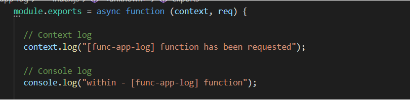
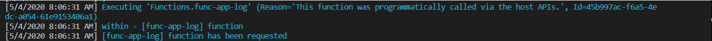
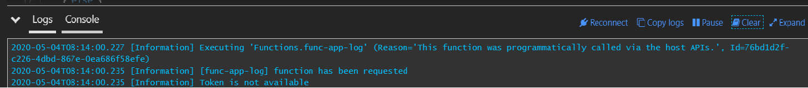
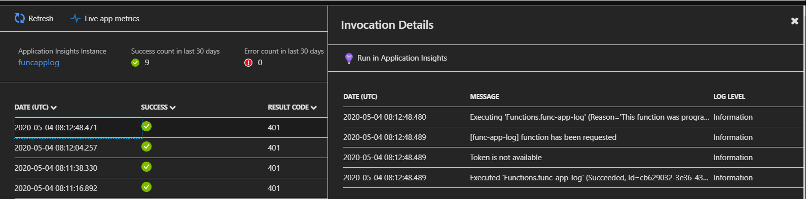
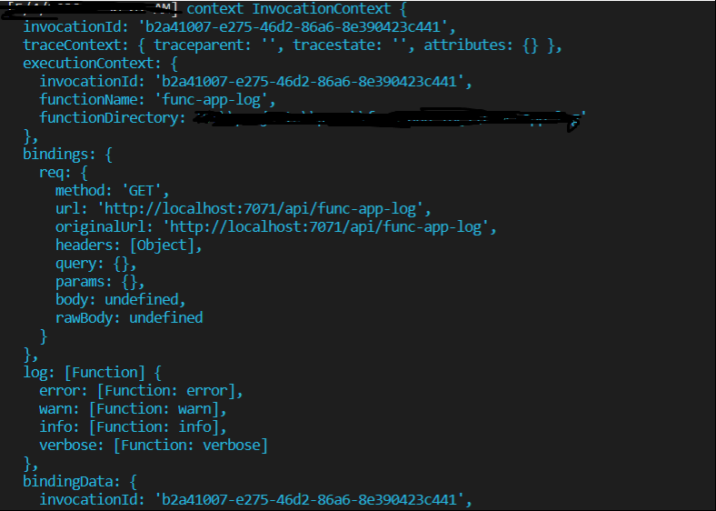
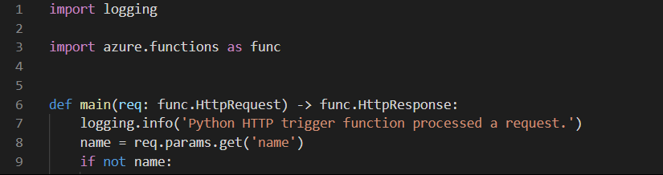
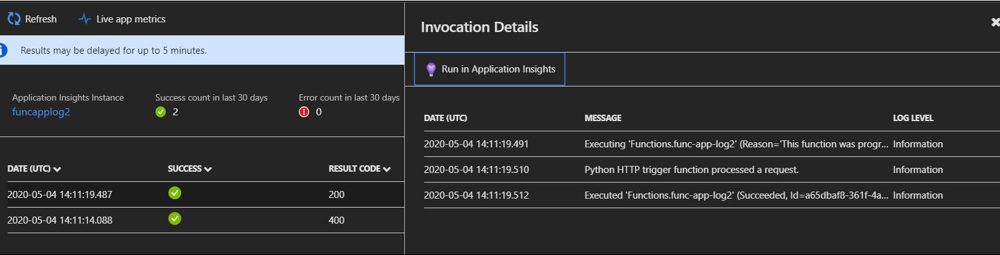
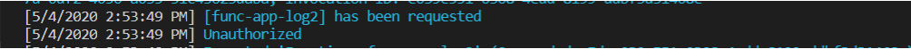
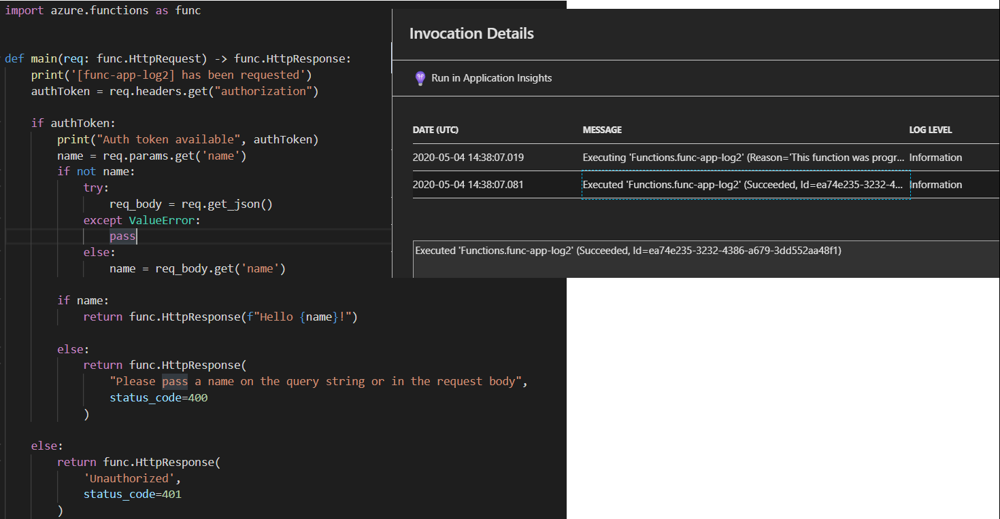

## Azure Functions - logging methodology [ Runtimes : NodeJs & Python ]


Logging is and has always been an important aspect of any modern application development. It's also a key point mentioned in [12 factor App](https://12factor.net/logs). And when we talk about **Azure Functions** it's not that so different. The more and more we have been relying on different cloud providers for application deployment we have also started relying on their integrated components for logging and tracing rather than writing something from scratch. For e.g - if you are coming from **AWS** background you would know that for every services there is available hook for you to enable it with **CloudWatch**. Similarly you would see **Azure Monitor** for **MS Azure**. These services let you do more than just normal logging for any instances of cloud service. Like - *Log Aggregations, Analytics, Reporting, Dashboarding* etc.. This actually helps to save the time from setting up those complicated log pipeline workflows for any applications. We can now focus on just on the application logic. In this article we would try to see how we can enable proper logging for individual function. 

Before we get started, I wanted to clarify that this article is not about tracing. There is a subtle difference between tracing and logging. Logging is the first step whereas tracing comes next, when you have log messages are available for someone to trace. Goal of this article is  - ***how to capture log messages within functions so that for future tracing ?*** Because if you started using *Azure functions* you might miss few specific tricks for logging. 

Again, when we talk about the logging we actually specify two set of aspects : **1) System Level logging** **2) Application level logging**.

**1) System Level logging :**  In *Azure functions* point of view, when we refer the system we actually mention the logging for the Function itself. By default system-generated log files get captured as a part of Application Insights.
	
**2) Application Level Logging :** For the application level logging we always need to capture internal details through specific internal function calls be it’s console or specific files. That means you need to specifically include those code snippet into your business logic to make it work. For our examples, we would use **NodeJs** and **Python** as runtimes but if you are using any other languages as runtime like **C# or Java** you can follow similar concepts.


**NodeJs :**

In JavaScript world, if you want to log something out from your function code you can easily use **console.log()**. If you have been using AWS lambda then you know console object is available globally and you can refer that object to log your messages or information example mentioned in [here](https://docs.aws.amazon.com/lambda/latest/dg/nodejs-logging.html).  

But in Azure functions this might not work out entirely. Because in Azure functions point of view **console** is not a global object. Though **console.log()** wouldn't throw any specific error or even it may log information when you are debugging in local. But it wouldn't capture information for App Insight or Function monitor.  Enough talking let’s see some code in actions :

Think you have a simple function with initial info logging like as per below :



When you are run the function app project locally and call specific function - http://localhost:7071/api/func-app-log you would see all the messages are getting printed properly. 



But when you try to look into the log directly in console after deployment in **Azure** you would notice **console.log()** message is not available. 



Similar thing you would notice when you go to **Monitor** section under Function while reviewing the details through [**App Insights**](https://docs.microsoft.com/en-us/azure/azure-monitor/app/app-insights-overview) where App Insights primarily to use the telemetry for the entire tracing.



***What is exactly happening in here ?***  - If you print the **"context"** object you would notice context object does actually holds a definition of log function. 

E.g : *context.log("context", context);*




So it's expected to use this log function of context object itself if we are planning to use console option of JavaScript in *NodeJs* runtime. 

Now the question comes - ***Do you have to pass on this context object in every subsequent function call if it's getting referred by function code ?*** - Short answer is **Yes.** That's the best way of doing it at least in *NodeJs* runtime.

**Python :**

When it comes to python runtime, it seems like both *AWS* https://docs.aws.amazon.com/lambda/latest/dg/python-logging.html and *Azure* uses default logging module. 
	






If you are planning to implement logs with **Print()** function for printing the message into console. That might not be a good idea after all. Though during local debugging messages get printed but it actually doesn't log anything after deployment in **Azure**.








If you have more than one function within one function app you could try possibly put your logger class under share code and which can be referred from different function.  Below could be simple class example :

```python

    import logging
	
	class LogHelper:
	    __logger = None
	    __context = None
	    def __init__(self, functionName, context):
	        self.__logger = logging.getLogger(functionName)
	        self.__context = context
	        self.__logger.setLevel(logging.INFO)
	    def log(self, message):        
	        modifiedMessage = f'[{self.__context.invocation_id}] ' + message
	        self.__logger.info(modifiedMessage)
	    def error(self, message):
	        modifiedMessage = f'[{self.__context.invocation_id}] ' + message
	        self.__logger.error(modifiedMessage)


```

This common shared code concepts holds true for any run time. Be it's a **NodeJs , Python , C# or even Java.**

**C# :** 

In your *C#* runtime of Azure functions you can pass in **ILogger** interface which would help you to capture structured logging. 

https://docs.microsoft.com/en-us/azure/azure-functions/functions-monitoring?tabs=cmd#ilogger


**In Summary :**

1) Logging options is subjected to get change in Azure functions based on the selected runtime.

2) As Function App is logical grouping of multiple functions - it's better if common refactored logger class can be used and referred from different functions. Because that can easily be extended and modified later point in time.

3) Also, it's not a good practice to use **Singleton** object if you are planning to use a common object for your entire function app. Because individual function has it's own context you should let that context get logged during the execution of individual function. If you use **Singleton** object for different functions it would get overridden by each other.

4) A very short summary can be found in here: https://docs.microsoft.com/en-us/azure/azure-functions/functions-monitor-log-analytics?tabs=javascript#user-generated-logs

5) Once right set of log gets captured then different tools can be used to analyze these logs. 
