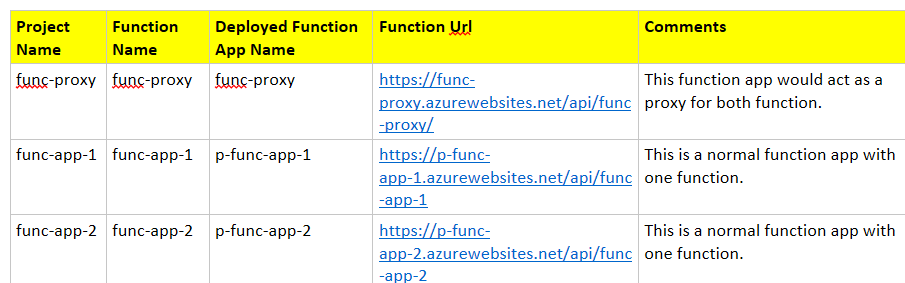
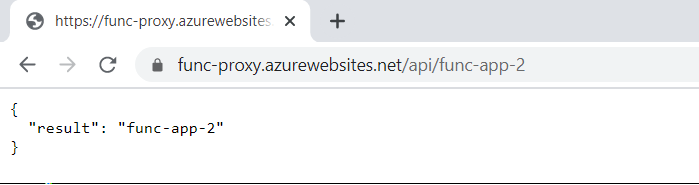
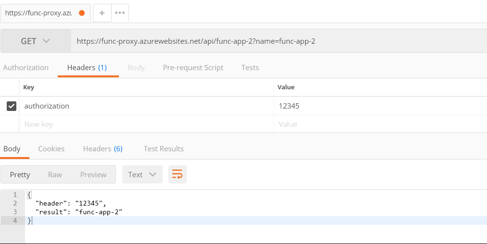
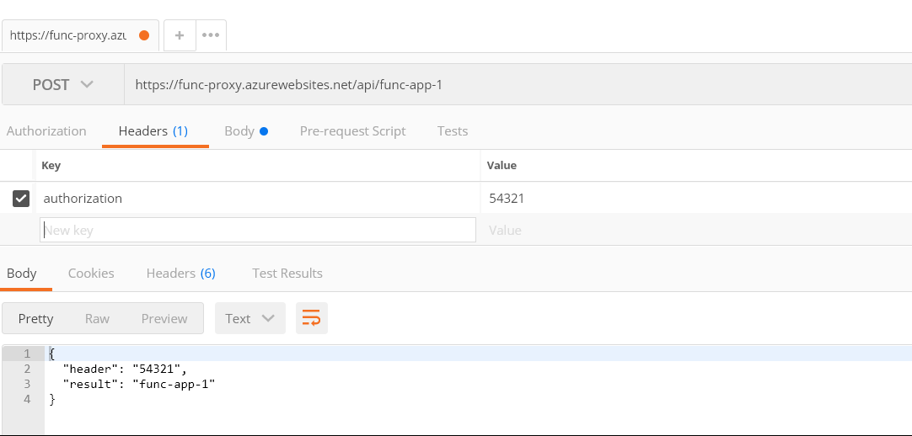
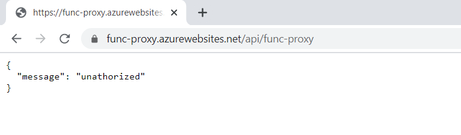
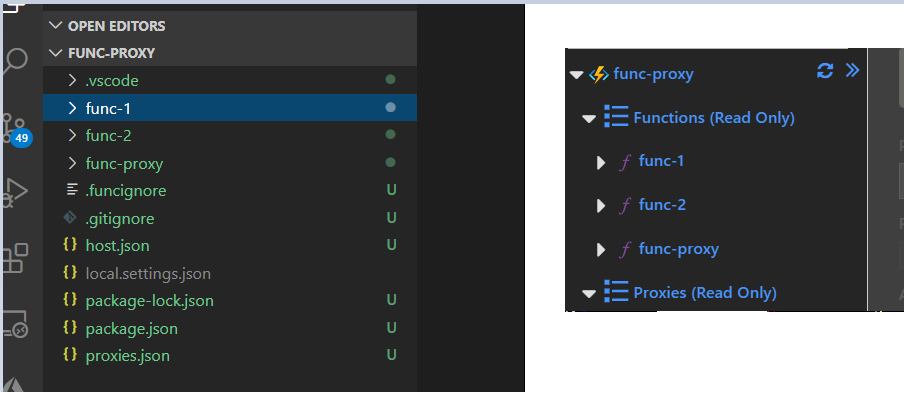

## Essentials Q&A on Azure Functions Proxy

The word **"Proxy"** has an interesting meaning - ***"the authority to represent someone else"***. This time I was actually able to realize it well (*"apart from my schooling days ,)"*) when I was trying to get my head around the concept of Azure Functions App.  

Last few weeks I was busy working with **Azure Functions** and it's different components. Then I heard about one term called - "Function Proxy" on which I had performed littile bit of experiments which has been captured below as Q&A format. Before you start reading this content I would recommend that you to refresh your thoughts on [Azure Functions](https://docs.microsoft.com/en-us/azure/azure-functions/functions-overview) if you are new to it.

**Prerequisite :** 

Below is the setup which you require if you want to follow along :




***Q - 1): How can you refer individual function end point through the proxy ?***

In your func-proxy project modify **proxy.json** as per below. 

```json

    {
	  "$schema": "http://json.schemastore.org/proxies",
	  "proxies": {
	    "func-app-1-proxy": {
	      "matchCondition": {
	        "methods": ["GET"],
	        "route": "/api/func-app-1"
	      },
	      "backendUri": "https://p-func-app-1.azurewebsites.net/api/func-app-1"
	    },
	    "func-app-2-proxy": {
	      "matchCondition": {
	        "methods": ["GET"],
	        "route": "/api/func-app-2"
	      },
	      "backendUri": "https://p-func-app-2.azurewebsites.net/api/func-app-2"
	    }
	  }
	}

```

That means instead of using actual function URL under function-proxy if you use configured route like - https://func-proxy.azurewebsites.net/api/func-app-2 or https://func-proxy.azurewebsites.net/api/func-app-1 you could see respective response. E.g :



***Q - 2): Can you pass request header(s) or query parameter(s) or payload as body to respective function API ?***

With little bit of Proxy configuration changes, it's pretty evident this can be done. As you could see we are able to pass Headers, Payload and Query string properly to the individual backend **Function API.**






In this case updated **proxy.json** looks to be something like this :

```json

	{
	  "$schema": "http://json.schemastore.org/proxies",
	  "proxies": {
	    "func-app-1-proxy": {
	      "matchCondition": {
	        "methods": ["POST"],
	        "route": "/api/func-app-1"
	      },
	      "backendUri": "https://p-func-app-1.azurewebsites.net/api/func-app-1"
	    },
	    "func-app-2-proxy": {
	      "matchCondition": {
	        "methods": ["GET"],
	        "route": "/api/func-app-2"
	      },
	      "backendUri": "https://p-func-app-2.azurewebsites.net/api/func-app-2"
	    }
	  }
	}


```

And one of the function app code. E.g: **func-app-1** looks like below :

```javascript

      module.exports = async function (context, req) {
	  context.log("within [func-app-1]");
	  var header = req.headers.authorization;
	  if (req.body && req.body.name) {
	    var name = req.body.name;
	    context.res = {
	      body: { header: header, result: name },
	    };
	  } else {
	    context.res = {
	      body: { "func-app-1": "no parameter pass" },
	    };
	  }
	};


```

***Q -3): Can you block a specific API route through configuration ?***

Yes, it can easily be done. It doesn't require any code changes in your individual function app.  So the **proxy.json** structure looks like as per below :

```json

{
  "$schema": "http://json.schemastore.org/proxies",
  "proxies": {
    "disable-root-proxy": {
      "matchCondition": {
        "route": "/"
      },
      "responseOverrides": {
        "response.statusCode": "400",
        "response.body": { "message": "Bad Request" }
      }
    }
  }
}

```

You can see 2 immediate benifits with this set of configuration.

 a) No one would be able to use your function app root URL. 

 b) Upon accessing the root url client would receive consistent error message. 

***Q - 4): Can you even mock the API response ? - Possibly when the actual backend is not ready.***

The answer is yes, that can be done too.  Configuration would look something like as per below: 

```json

{
  "$schema": "http://json.schemastore.org/proxies",
  "proxies": {
    "disable-root-proxy": {
      "matchCondition": {
        "route": "/api/{all}"
      },
      "responseOverrides": {
        "response.statusCode": "200",
        "response.body": { "result": "success" }
      }
    }
  }
}

```

The meaning of above configuration is - whichever individual function API gets called by the client it would get back a status of "200 OK" response with mock body mentioned in the **response.body** section.


***Q- 5): Can you even put some code in function proxy to validate request header and then would you be able to pass the request to respective function ?***

This could be the extension of **Q-2**, where we would like to include authorization header validation logic in Function proxy itself rather than duplicating it individual function app.

To do this test we thought of modifying the function-proxy **index.js** code as per below :

```javascript

module.exports = async function (context, req) {
  context.log("[Within Func-Proxy]");
  var tokenValue = req.headers.authorization;
  context.log("tokenValue", tokenValue);
  if (typeof tokenValue == "undefined") {
    context.res = { body: { message: "unathorized" } };
  } else {
    context.res = {
      body: {
        message: "Token has passed. Redirect to specific function app",
      },
    };
    // How to redirect to specific API from here on ?
  }
};

```

And if we configure the **proxy.json** as per below :

```json

{
  "$schema": "http://json.schemastore.org/proxies",
  "proxies": {
    "func-app-1-proxy": {
      "matchCondition": {
        "methods": ["POST"],
        "route": "/api/func-proxy/func-app-1"
      },
      "backendUri": "https://p-func-app-1.azurewebsites.net/api/func-app-1"
    },
    "func-app-2-proxy": {
      "matchCondition": {
        "methods": ["GET"],
        "route": "/api/func-proxy/func-app-2"
      },
      "backendUri": "https://p-func-app-2.azurewebsites.net/api/func-app-2"
    }
  }
}

```

Though we are able to access the respective API as we did in **Q-2**  and also when we call **func-proxy** app directly with that URL but after successful validation we are not able to pass the request to individual function end point. Because from the code perspective we don't have any provision to that.




***Q - 6): Let's say if you enable proxy for individual function app rather than using a centralized function app as proxy, still wouldn't you be able to validate the header of incoming request and then forward it to respective function ?***

The short answer is **"No"**. In that scenario you would require to directly call the individual function url.

If you create a  different project structure - which looks to be something like below. You would end up calling individual **function url** of a **function app**. Because you would need to keep it mind that Function App doesn't hold any code logic of it's own apart from specific individual function.

You can define the proxy of in this function app as well and define your **proxy.json** to perform above test.




Well, I guess that was too much information to digest and I understand that. So let's summarize :

1) Azure functions proxy it's basically a configuration mechanism by which you can hide or protect your actual function configuration. 

2) For each function app there is one proxy.json where necessary configuration must be placed and it should follow schema - http://json.schemastore.org/proxies
3) You can override request/response of any function API end point whenever it gets called.
4) It could be useful to send the mock response to client when your API is not fully ready.
5) You wouldn't be able to call or plug in your custom code / logic in your function proxy for certain validation or operation. It's just a configuration. 

With that said, I guess there is further more to it for someone to a deep dive an explore. Below are few useful references :


***```References :```***

https://docs.microsoft.com/en-us/sandbox/functions-recipes/proxies


***```Open Issues :```***

https://github.com/Azure/azure-functions-host/issues/1567
https://github.com/Azure/Azure-Functions/issues/331


Happy Proxying ,)