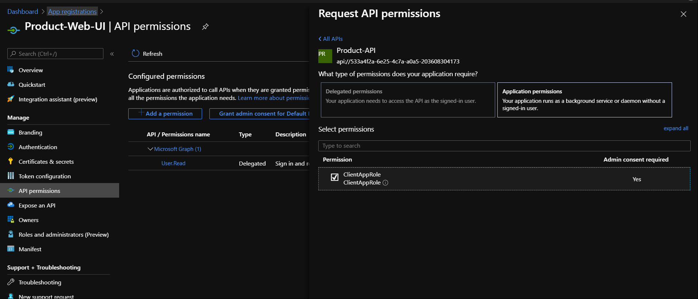

# Securing Custom API with Azure AD

In this article we would try to see how we can secure a custom API with help of **Azure AD**. If you are new to Azure AD, I would highly recomend you to refresh your memory on Azure AD with this [Q&A](https://github.com/sughosneo/blogs/blob/master/azure/az_ad_q_%26_a.md)

The API has been built here using dotnet core framework but these concepts are programming language or framework agnostics.

Before we go further, I wanted to talk about the fact that in modern app developement authentications or authorizations plays a very key role. It was important earlier as well but as we move more towards granular components for e.g microservices, serverless etc.. there has been a need of separate **Identity Provider**. So that we don't need to repeat the same set of auth logic in each application component repetitively. That's where possibly **Azure AD** plays a very key role. It not only helps to secure any service instances on the cloud it also provides flexibility to regiser and secure any of your custom built component with minimal configuration. 

***```Application Facts```*** :

- There are 2 components in this solution : 
    - Prodocut.API (*custom api component*)
    - Product.Web.UI (*web ui component*)

- Technology used - dotnet core 3.1
- Urls :
    - Api Url : https://localhost:44311/api/products
    - Web App : https://localhost:44351/products

- Configurations are kept under *appsettings.json*. 

- Keys are exposed considering it as demo app.But it's not advisable for production purpose.

**```Scenario - "Without Auth"```**

Let's review no auth scenario.


If you run the application you would see following :


**```Scenario - "With Auth"```**

Now, let's try to make this custom **Product.API** secure. If we see below diagram we would see notice that our custom built API is protected by the Azure AD. To fetch product details from API, now web app requires token from Azure AD.


Let's see how easily we can make it happen.

***```Step - 1```***

Login to Azure Portal and go to the App registration. 


***```Step - 2```***

Register Product.API as an applcation. 
We are going ahead with the options of all accounts or users registered under Azure AD tenant can access this API. There are few more options which someone can refer in [here](https://docs.microsoft.com/en-us/azure/active-directory/develop/quickstart-register-app)


***```Step - 3```***

To let the API been discoverable as resource under Azure AD it needs to be exposed and it can be done clicking below option. 


***```Step - 4```***

It's time to update the API manifest file to define the application level permissions while accessing the API. It would be required to let the *Product.Web.UI* know what set of resources it can access of *Product.API*


***```Step - 5```***

With that configurattion done for *Product.API*, it's time now to make some modifications in our *Product.API* project. 


Now, we would require to enable JWT authentication for our API. To do so we would require to install necessary Nuget package. 


Once the necessary package is enabled, it's time to **Add** and **Use** the authentication in API project startup class. 


We would also need to make sure API controller gets secure through **Authorize** attribute. Individual HTTP methods also can be decorated with this atriibute.


After these changes if you run the API over browser it wouldn't be accessible any more.


And when the API gets called from the Postman then it shows **"401 Unauthorized"**. Even response header shows clear authentication header information.


***```Step - 6```***

It's time to set up the *Product.Web.UI* and that can be similar way like API. In this scenario we are not setting up any Redirect URI because we wouldn't want to set up any login popup redirect mechanism in this sample. We would primarily want Client Web App to acquire the token while making further request.


***```Step - 7```***

As in our web app we are not setting up interactive login flow with Azure AD, primarily our web app would identify itself to Azure AD and fetch the necessary access token for api. So web app to identify itself, it requires Client Id and Client Secret, which gets configured in below step. 


***```Step - 8```***

Now, we have to configure necessary permissions for *Product.Web.UI* so that it can access *Product.API*




Note : This is the same role which we had defined in API manifest file. There could be many such roles configured in API side based on the different clients.


***```Step - 9```***
Web app configuration is done and we just need to make sure while calling the rest API we are passing necessary **access token** on the token. For that we would use latest MSAL library for interacting with Azure AD


<details>

<summary>Fetch Token & API Request</summary>
<p>

```C#

        /// <summary>
        /// 
        ///     Method to fetch token from latest oAuth2 token flow.
        /// </summary>
        /// <returns></returns>
        private async Task<string> GetAccessToken()
        {
            var clientId = _configuration.GetValue<string>("AzureAD:ClientId");
            var clientSecret = _configuration.GetValue<string>("AzureAD:ClientSecret");
            var tenantId = _configuration.GetValue<string>("AzureAD:TenantId");
            var apiResourceId = _configuration.GetValue<string>("AzureAD:APIResourceId");
            var authorityUrl = $"{_configuration.GetValue<string>("AzureAD:InstanceId")}{tenantId}/oauth2/v2.0/token";

            _clientApp = ConfidentialClientApplicationBuilder.Create(clientId)
                .WithClientSecret(clientSecret)
                .WithAuthority(new Uri(authorityUrl))
                .Build();

            string[] scopes = new string[] { apiResourceId };

            try
            {
                AuthenticationResult result = await _clientApp.AcquireTokenForClient(scopes).ExecuteAsync();
                return result.AccessToken;
            }
            catch (MsalClientException ex)
            {
                throw ex;
            }

        }

        /// <summary>
        ///     This is OnGet() method with authorization access token.
        /// </summary>
        /// <returns></returns>
        public async Task OnGet()
        {
            try
            {                
                var productAPIUrl = _configuration.GetValue<string>("ProductAPIUrl");
                var accessToken = await GetAccessToken();

                if (!String.IsNullOrEmpty(accessToken))
                {
                    var defaultRequestHeaders = _httpClient.DefaultRequestHeaders;
                    defaultRequestHeaders.Authorization = new AuthenticationHeaderValue("bearer", accessToken);

                    var response = await _httpClient.GetAsync(productAPIUrl);

                    if (response.StatusCode == System.Net.HttpStatusCode.OK)
                    {
                        var result = await response.Content.ReadAsStringAsync();

                        listOfProducts = JsonConvert.DeserializeObject<List<Products>>(result);
                    }
                    else
                    {
                        throw new Exception(response.ToString());
                    }
                }

            }
            catch (Exception ex)
            {
                errorMessage = ex.Message.ToString();
            }
        }
        
```
</p>
</details> 

If you are using any other popular client like **Postman** then you can follow below details to generate token and call the API.


Well, that was all for this use case. Please note, this example was more focused on real scenarios where different components in an application can talk to each other securely without user intervention. But that scenario also can be achieved on the same sample by making few tweaks in configuration.


Detailed code can be found in this [repo](https://github.com/sughosneo/AzureADAuth)

Keep securing !