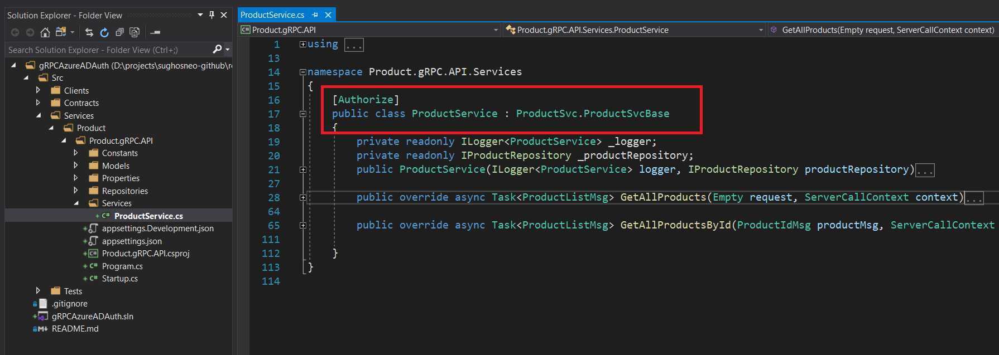

# Securing gRPC Service with Azure AD

With the App modernizations and advancement of miroservices, gRPC services are getting popular day by day. And that's the reason it has become more important than ever to make those services secure before they hit production. One of the common pattern which has been observed in many projects is that internal communications among microservices happen RPC but the API(s) which are exposed to outside for the client or even for other services through API gateway still follows restful standard. One of the common reason could be lack of HTTP2 support in API Gateway or direct Authentication/Authorization implementations on gRPC services itself.

So in this article we would try to see how we can secure a gRPC service with help of **Azure AD**. If we are using **ASP.NET Core** as technology for building gRPC service then we have few of the [options](https://docs.microsoft.com/en-us/aspnet/core/grpc/authn-and-authz?view=aspnetcore-3.1#other-authentication-mechanisms) upfront. But if you are new to gRPC and Azure AD, then below links could be helpful to refresh concepts with following resources:

- [gRPC - Orignial Doc](https://grpc.io/)

- [gRPC - C# Microsoft Doc](https://docs.microsoft.com/en-us/aspnet/core/grpc/basics?view=aspnetcore-3.1)

- [gRPC - Demo API Implementation In Python](https://github.com/sughosneo/gRPCRest)

- [Azure AD Q&A](https://github.com/sughosneo/blogs/blob/master/azure/az_ad_q_%26_a.md)

***```Application Facts```*** :

- There are 3 components in this solution : 
    - Contracts.Lib (*holds all contracts proto files*)
    - Product.gRPC.API (*custom gRPC api component*)
    - ProductSvc.Consumable.Client (*console client component*)    

- Technology used - dotnet core 3.1

- Configurations are kept under *appsettings.json*. 

- Keys are exposed considering it as demo app.But it's not advisable for production purpose.

- Test Project for the Functional test of *Product.gRPC.API* service.

**```Scenario - "Without Auth"```**

Let's review no auth scenario.

If you are using *gRPC Service* template in Visual Studio, you already have a boiler plate code to start  and play around with. But my personal preference to keep *Proto* files in a separate a project which can be referred by both server and client. For e.g - Project *Product.gRPC.API* actually refers *Contracts.Lib* to generate the necessary server side code from *"product.proto"* file. 

In service project, 


Then we just need to override and implement necessary service methods in **ProductService** file to make it functional. 

Once the service is ready, it's time to built up the client. For that also necessary methods can be generated with the same proto file. Please note client could be of any type but I am using console client for simplicity.


We would also be required to have reference of following packages added in the client. 


After that we should be able to talk to the service from the client.


**```Scenario - "With Auth"```**

Now, let's talk about how can we make sure this "Product.gRPC.API" secure ? If we see below diagram we would notice that our custom built API is protected by the Azure AD. To fetch product details from API, now client requires token from Azure AD.


Let's go through those details step by step. 

***```Step - 1```***

Login to Azure Portal and go to the App registration. 


***```Step - 2```***

Register *Product.gRPC.API* as an applcation. 
We are going ahead with the options of all accounts or users registered under Azure AD tenant can access this API. There are few more options which someone can refer in [here](https://docs.microsoft.com/en-us/azure/active-directory/develop/quickstart-register-app)


***```Step - 3```***

To let the API been discoverable as resource under Azure AD it needs to be exposed and it can be done clicking below option. 


***```Step - 4```***

It's time to update the API manifest file to define the application level permissions while accessing the API. It would be required to let the *Product.Web.UI* know what set of resources it can access of *Product.API*


Sample json can be found as per below :

```json
{
      "allowedMemberTypes": [
        "Application"
      ],
      "description": "Read-only access to api data",
      "displayName": "ConsoleClientAppAccessRole",
      "id": "45970f98-7762-4e-------------",
      "isEnabled": true,
      "lang": null,
      "origin": "Application",
      "value": "ConsoleClientAppAccessRole"
    }

```

***```Step - 5```***

Before we jump back into the code, let's finish up the client related configurations as well. In this scenario we are not setting up any *Redirect URI* because we wouldn't want to set up any login popup redirect mechanism in this sample. We would primarily want Client App to acquire the token while making further request.


***```Step - 6```***

As in our client app we are not setting up interactive login flow with *Azure AD*, primarily our client app would identify itself to Azure AD and fetch the necessary access token for *Product.gRPC.API*. So console client app to identify itself, it requires *Client Id* and *Client Secret*, which gets configured in below step. 


***```Step - 7```***

Now, we have to configure necessary permissions for *ProductSvc.Consumable.Client* so that it can access *Product.gRPC.API*


Note : This is the same role which we had defined in API manifest file. There could be many such roles configured in API side based on the different clients.


***```Step - 8```***

After adding the permissions you may need to grant Admin consent on that permissions. That can be done with a click.


***```Step - 9```***

All the relevant configurations are over.Now we would need to make few changes in *"Product.gRPC.API"* project to make it secure. To start with, project related settings can be kept under :


After that we would require to install JWTBearer related Nuget package so that it can be referred.


It's required to protect ProductService with authorize attribute.




***```Step - 10```***

It's time now we include necessary configuration in client side as well so that it passes on necessary token while making API call. To start with we have placed one *appsettings.json* file where we have kept all the configuration.


Along with the configuration it requires to have necessary Nuget packages as well which can be seen as per below :


Now with every subsequent request, we would require to pass on Bearer token along with required parameter. For e.g : Code to find specific Id can be refered as per below :

<details>

<summary>Fetch Token & Make gRPC Request</summary>
<p>

```C#

        /// <summary>
        ///     Method to fetch necessary access token
        /// </summary>
        /// <returns>string</returns>
        static async Task<string> GetAccessTokenAsync(IConfiguration configuration)
        {
            Console.WriteLine("ProductSvc.Consumable.Client:: Fetching access token");

            try
            {

                var clientId = configuration.GetValue<string>("AzureAD:ClientId");
                var clientSecret = configuration.GetValue<string>("AzureAD:ClientSecret");
                var tenantId = configuration.GetValue<string>("AzureAD:TenantId");
                var apiResourceId = configuration.GetValue<string>("AzureAD:APIResourceId");
                var authorityUrl = $"{configuration.GetValue<string>("AzureAD:InstanceId")}{tenantId}/oauth2/v2.0/token";

                IConfidentialClientApplication _clientApp = ConfidentialClientApplicationBuilder.Create(clientId)
                    .WithClientSecret(clientSecret)
                    .WithAuthority(new Uri(authorityUrl))
                    .Build();

                string[] scopes = new string[] { apiResourceId };

                AuthenticationResult result = await _clientApp.AcquireTokenForClient(scopes).ExecuteAsync();
                return result.AccessToken;
            }
            catch (MsalClientException ex)
            {
                Console.WriteLine("ProductSvc.Consumable.Client:: Exception while loading configuration");

                throw ex;
            }
        }


        /// <summary>
        ///     Method to fetch specific product details
        /// </summary>
        /// <returns>string</returns>
        /// 
        private static async Task<string> GetSpecificProductDetailsAsync(string productGrpcAPIUrl, string accessToken)
        {
            try
            {
                Console.WriteLine("ProductSvc.Consumable.Client:: Calling Product grpc API..");

                var requestHeaderMetadata = new Metadata()
                {
                    { "Authorization", $"Bearer {accessToken}"}
                };

                var channel = GrpcChannel.ForAddress(productGrpcAPIUrl);
                var client = new Contracts.Lib.ProductSvc.ProductSvcClient(channel);                
                var productIdMsg = new ProductIdMsg() { Id = 1 };
                var response = await client.GetAllProductsByIdAsync(productIdMsg, requestHeaderMetadata);

                return response.Productmsgs.ToString();
            }
            catch (Exception)
            {

                throw;
            }
        }

```
</p>
</details> 

You can perform similar test if you are using any other gRPC client side tool like [BloomRPC](https://github.com/uw-labs/bloomrpc)

Well, in this example we have used *Azure AD*, if you are planning to use any other service as identity provider certainly you can. But you wouldn't be able to use any windows related authentication [here](https://docs.microsoft.com/en-us/aspnet/core/grpc/authn-and-authz?view=aspnetcore-3.1)

Detailed code can be found in this [repo](https://github.com/sughosneo/gRPCAzureADAuth)

Keep securing your API(s) ! It's good thing ,)


**```Further References```**

[1] Http2 - [https://http2.github.io/faq/](https://http2.github.io/faq/)

[2] gRPC Error Handling - [https://grpc.io/docs/guides/error/](https://grpc.io/docs/guides/error/)

[3] gRPC different examples - [https://github.com/grpc/grpc-dotnet/tree/master/examples](https://github.com/grpc/grpc-dotnet/tree/master/examples)


