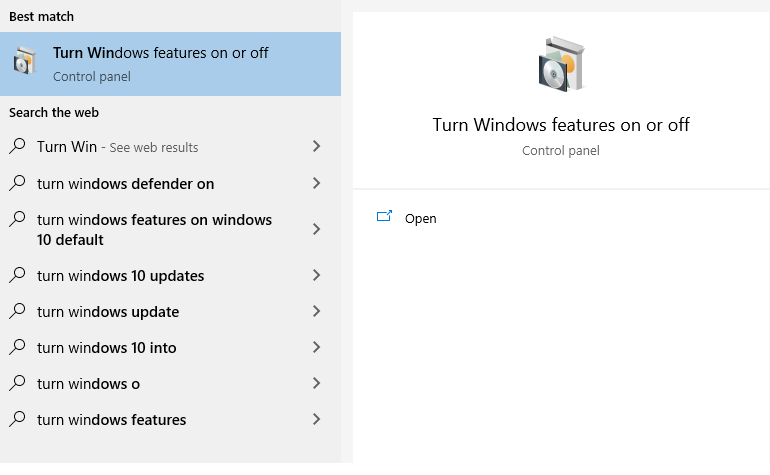
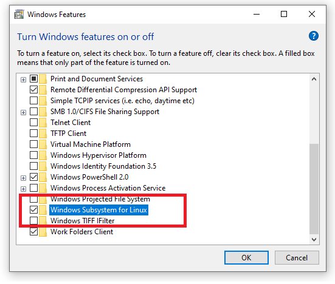
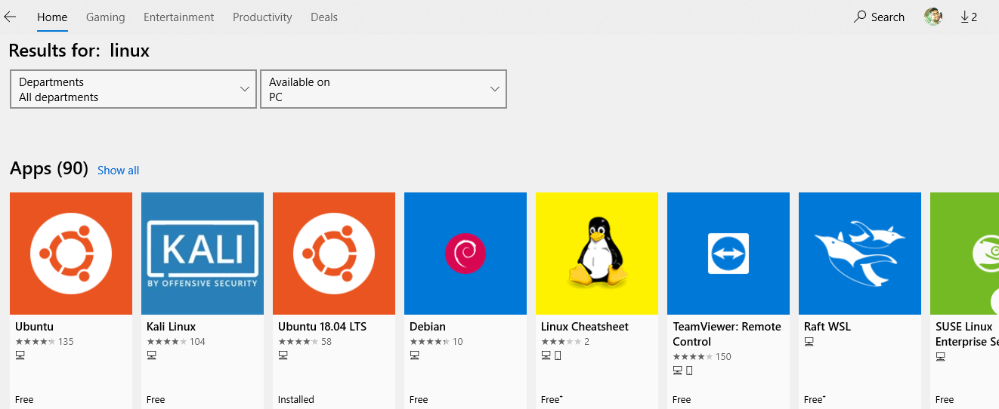
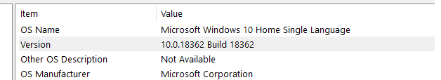
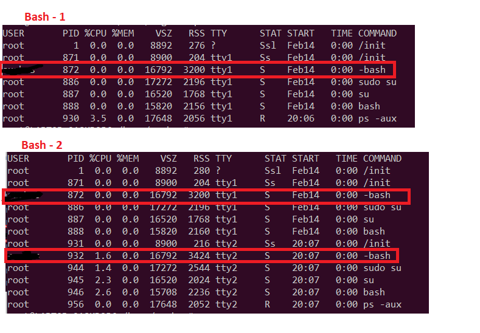
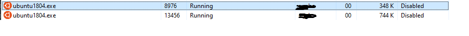

### Bash Shell On Windows 

If you are coming from Linux background and quite used to shell be it's either bash/sh based on your linux distro 
then you might feel little uncomfortable using windows command line or PowerShell. You overcome this using GitBash for your managing 
your directories or normal operations. Well, now you might not have to worry about this that much because Windows 10 has a
new feature which is called "Windows Subsystem for Linux".

***How to enable this on your Windows OS ?***

 

  

Then you can install one of your Bash shell for an example (Ubuntu 18.04) for your use.

***Since when was it available for users ?***

Since 2016 this feature has been available in Windows 10. 
It's available as a feature in Windows 10 latest upgrade.
Here is the OS build number which I am using. 

***How is it different from a Virtual Machine ?***

- Now to avoid confusion would like to mention that this is not the Virtual Machine. 
- Basically It's the Linux binaries which are wrapped as a separate process where both User mode and kernal model available.
- That means when user opens up one Bash shell (For an ex : Ubuntu app on Windows 10) it actually initiates one process which contains all the linux binaries
that's the reason user would be able to run all set of supported linux commands. But when user executes those command it actually gets converted to a system call 
from user space to kernal space. Where primarily User Model Linux binaries pass the control to Windows Kernal to make those system call. But it's actually it uses the host machine resources like - File System or Memory usage.
- This methodology is similar like containers (like - Docker) where it has isolation in user space but uses host machine for resources.
- So this is evident that where Virtual Machine is full fledged OS but Windows Subsystem for Linux is not.  

***How many process does it get initiated when user opens multiple bash ?***

Though we had discussed this aspect before in previous question but just to double confirm, yes it initiates different 
processes. If you see you would notice that different bash process gets generated as we opens up different bash shell.
For windows level also it actually gets mapped to different processes.

 

But there are certain constraints are there with this approach which you might not see in your linux distro in a Virtual Machine.
For an example : If you wanted to install Docker in your Ubuntu app on Windows 10, you might not able to do that if your host windows machine 
doesn't support that. But in scenarios of Virtual Machine that might not be a restriction. Having said, that whatever it's a great 
advantage for the folks who are coming from the Linux background. It's real easy for this using Bash for many useful things.. like 
programming - Python, Vim etc.. 

References :
---------------------

[1] - https://docs.microsoft.com/en-us/windows/wsl/install-win10

[2] - https://docs.microsoft.com/en-us/archive/blogs/wsl/windows-subsystem-for-linux-overview

[3] - https://docs.microsoft.com/en-us/windows/wsl/faq