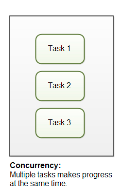
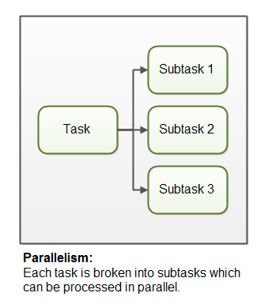

### Concurrency vs. Parallelism

***Concurrency***
When multiple tasks are performed in overlapping time periods with shared resources (potentially maximizing the resources utilization).

***Parallelism***
When single task is divided into multiple simple independent sub-tasks which can be performed simultaneously.

***Different Type Of Concurrency***
Here are the different types of concurrency and parallelism implementation in python 3.7 

https://github.com/sughosneo/pyconcurrencydemo

Ref :

http://tutorials.jenkov.com/java-concurrency/concurrency-vs-parallelism.html
https://stackoverflow.com/questions/1050222/what-is-the-difference-between-concurrency-and-parallelism

