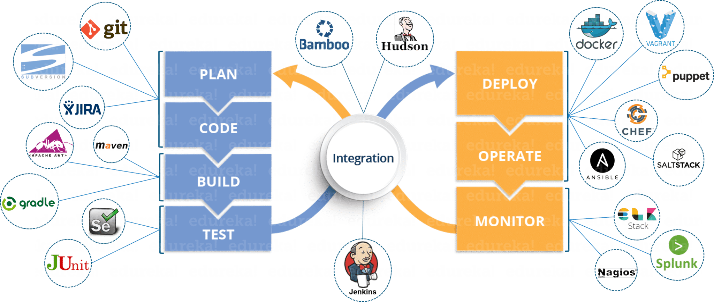

## Devops Fundamentals

There has been lot of talks about the new guide line of software developement particularly in terms of SAAS/PAAS model where continous developement, continous deployment is absolutaly mandatory reqiorement. Devops has become a core integrated process of most of the organization those who primarily focus on product or platform developement.

But always there are some basic questions which comes on mind while we talk about this terminology.

In this article we would try to look into few of the popular references which possibly gives answer to below questions.

***`Key points in Devops`***

- It's a integral part of the modern software developement methodology. 
- More like process/practice performed by engineers.
- This is the way based on how developement and operation collaborates togerth to release the newer version of the software or product efficiently.
- Entier product release cycle or timeline gets reduced.
- Proper unit testing can be done for the software before deploying the changes in production.
- Possible to do continuous integration and deployment of new features.
- Detailed monitoring and coverage for the product code base.
- Possible to find any specific bug well before deployment rather than waiting it till the end.

***`Tools in devops`***

#### References :

- https://medium.com/@yannmjl/what-is-devops-in-simple-english-6550fbb129bd

- https://medium.com/faun/all-about-devops-fundamentalsyou-ever-wanted-to-know-2333328a2b40
