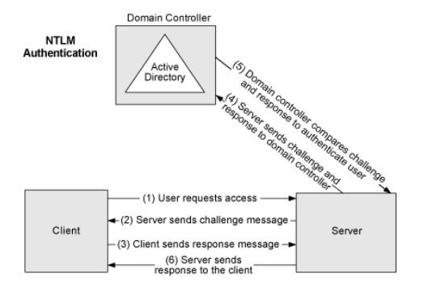

### Different - Authentication & Authorization Mechanism

In one of the recent interactions with my colleagues, we got to know none of us have ever seen a
consolidated article which talks about different popular and so far adopted authentication and authorization mechanism be it's API point of view
or from web app or mobile app or even desktop app point view. It's not like that there are no articles on that. There are plenty of good articles but there is not a one which could be a go to reference for any developer or architect.
This would be my target in this article to put together a summary of different such methodologies which are popular and very much common in use.

When I search the term "Authentication" in wikipedia I found this reference [article](https://en.wikipedia.org/wiki/Authentication) which provides a generic definition of 
authentication and talks about different types of it. [Authorization](https://en.wikipedia.org/wiki/Authorization) nowhere to be different on that. 
In generic when we talk to about the authentication type we actually refer either of any types ***a user*** or ***an entity.***
But in this article we would keep the scope of the discussion very much limited to only below categories.

1) Web Applications. (Ex. - Enterprise level hosted applications or SAAS applications)
2) Mobile Applications. (Ex - Any mobile apps enterprise based or consumer facing)

From the application point of view if you think through it's nothing but the API which actually helps to manage the authentication 
for the entire applications. So we just need to focus on the protocol which is noting but the HTTP and the API security.
Yes, still people may ask the questions how about the access of resources and accessing specific components or modules ? answer is - that's part of authorization
and also if you think carefully it's again accessing different features through api(s). So ultimate story is we would just need to focus on authentication in api/service level.

Let's look at those one at a time. 

- ***`Cookie Based Authentication**`*** =>
    
    - Before token revolution, web application authentication mechanism were used rely on the traditional cookie based authentication 
mechanism. Where user or entity used to share the user name and password to get a respective session details which used to get saved as browser cookie or server side cookie.
    - It used be part of the HTTP authentication scheme.
    
     
     
     Image Source : https://dzone.com/articles/cookies-vs-tokens-the-definitive-guide
     
    - Once client used to get authenticated it used to get back the session which it used to pass along for subsequent resource access.
    - Session used to get saved and refreshed based on mechanism adopted in the server side. Server manages that session most of the time.
    - In this authentication type client or entities used to send either user name and password as encoded or few of the time they used to send it encrypted string which used to get validated against
        a database or centralized storage.
    
    **Use Case :**
        Older mechanism to authenticate web applications. 

- ***`LDAP Authentication**`*** =>
    
    - Enterprise web application are around for long time and so do Active Directory for any organization.
    - So leveraging that for any web based or desktop based applications are quite obvious choice for sometime. 
    - LDAP authentication is secure industry standard easy to implement. It's better than any cookie based authentication over all.    
    
    
    
    Image Source : https://support.citrix.com/article/CTX222444
    
    - It actually works based on "Lightweight Directory Access Protocol"
    
    **Use Case :**
        Enterprise level web applications where active directories are already present and can be leveraged as identity provider for a
        user or entity during accessing the application. 
        
    With the Active Directory as identity provider in place, it actually brought other popular authentication protocol and mechanism. Like :
    
    ***`NTLM Authentication`*** 
    
    - NTLM is an authentication protocol. It was the default protocol used in old windows versions, but it’s still used today. If for any reason Kerberos fails, NTLM will be used instead.
    
    
    
    ***`Kerberos Authentication`***
    
    - Kerberos is an authentication protocol. It’s the default authentication protocol on Windows versions above W2k, replacing the NTLM authentication protocol.
    
    
    
            
There were and are even scenarios when active directory or domain controller were in place or for that matter applications which follow B2C model
for that also user authentication were pretty much needed. Slowly encoded string based authentication were started gaining popularity.
One of the easy and useful one is 

- ***`Basic Authentication**`*** => 
    
    - It's a HTTP authentication scheme.
    - It's the simplest and basic amongst all. It name also suggest same.
    - In this method sender entity places a username: password into the request header. 
    - The username and password are encoded with **Base64** which is the important factor. 
    - Here’s an example of a Basic Auth in a request header:
    
        *Authorization: Basic bG9sOnNlY3VyZQ==*
    
    - It should only be used over HTTPS(SSL)

Since the time token based authentication has emerged and popularized web based applications popularity and security 
has been increased drastically. Below are few of the popular token based authentication mechanism. But over all a modern token based 
authentication can be summarized with below flow.

    
   
    
   Image Source : https://dzone.com/articles/cookies-vs-tokens-the-definitive-guide
     
    
- ***`Bearer Authorization`*** =>
    
    - It's a HTTP authentication scheme.
    - The Bearer authentication scheme was originally created as part of OAuth 2.0 in RFC 6750
    - The bearer token is a cryptic string, usually generated by the server in response to a login request
    - Here’s an example of a Bearer Auth in a request header:
    
        *Authorization: Bearer token_value*
    
    - It should only be used over HTTPS(SSL)

- ***`JWT Authorization`*** =>    
    
    - Again it's a HTTP authentication scheme and called as "Json Web Token" where javascript object information gets passed along.
    - Well if we just talked about token authentication then how is this different from bearer authentication ?
    - Before JWT token a <token> was just a string with no intrinsic meaning, e.g. 2pWS6RQmdZpE0TQ93X. 
        It used to get match with backend storage like DB or cache. But with JWT it contains all the information within itself which is signed with own claims.
    - JWT tokens are self-contained. It consists of 3 different parts.
    - It's mainly get used for authorization flow. 
                    
    
    
    Image source - https://jwt.io
    
    JWT consists of three parts:

    - Header, containing the type of the token and the hashing algorithm
    - Payload, containing the claims
    - Signature, which can be calculated as follows if you chose HMAC SHA256: HMACSHA256( base64UrlEncode(header) + "." + base64UrlEncode(payload), secret)
    
    **Use Case :**
        
        Probably one of the most popular and common resource authorization mechanism for any web applications or api.
        

- ***`Key Authentications`*** =>

    - In the rest API security it's most widely used authentication.
    - It's also called as API key authentication.
    - In this scenario one predefined key gets assigned to the user or entity who actually request for specific resource.
     
    
    
    Image source - https://dzone.com/articles/four-most-used-rest-api-authentication-methods
            
    **Use Case :**
    
        When user subscribe for any api which it needs to make a call regularly. For individual user or entity rest api server assign
        one subscription key / api key.
    

- ***`Security Assertion Markup Language Tokens (SAML)`*** =>

    - Security Assertion Markup Language (SAML) is an open standard that allows identity providers (IdP) to pass authorization credentials to service providers (SP). 
      What that jargon means is that you can use one set of credentials to log into many different websites.
      
    - SAML simplifies federated authentication and authorization processes for users, Identity providers, and service providers.
       
    - It's primarily use XML to perform communication. A simple SAML with url would look something like as per below :
        
       ```python
           https://idp.example.org/SAML2/SSO/Redirect?SAMLRequest=fZFfa8IwFMXfBb9DyXvaJtZ1BqsURRC2Mabbw95ivc5Am3TJrXPffmmLY3%2FA15Pzuyf33On8XJXBCaxTRmeEhTEJQBdmr%2FRbRp63K3pL5rPhYOpkVdYib%2FCon%2BC9AYfDQRB4WDvRvWWksVoY6ZQTWlbgBBZik9%2FfCR7GorYGTWFK8pu6DknnwKL%2FWEetlxmR8sBHbHJDWZqOKGdsRJM0kfQAjCUJ43KX8s78ctnIz%2Blp5xpYa4dSo1fjOKGM03i8jSeCMzGevHa2%2FBK5MNo1FdgN2JMqPLmHc0b6WTmiVbsGoTf5qv66Zq2t60x0wXZ2RKydiCJXh3CWVV1CWJgqanfl0%2Bin8xutxYOvZL18NK
       ```       
    
    - SAML workflow would look something like.
    
    
    
    Image Source : https://en.wikipedia.org/wiki/SAML_2.0

- ***`OAuth (2.0)`*** =>
        
    - OAuth 2.0 is the industry-standard protocol for authorization.
    - OAuth standards are newer of SAML.
    - There are 2 proper ways actually the authorization flow goe through.
    - It works by delegating user authentication to the service that hosts the user account, and authorizing third-party applications to access the user account. 
    - There are mainly 2 channels involved in the OAuth2.0. Front channel and back channel and it's flow  
    - It's one of the popular authorization workflow by which modern authorization gets taken care.
    - It has following terminologies.
        - Resource Owner
        - Client
        - Authorization Server.
        - Resource Server.
        - Authorization Grant
        - Redirect URI
        - Access Token
    
    It follows either of this below flow. Authorization flow or implicit flow. 
    
    
        
    
    
    
    Image Source : https://www.digitalocean.com/community/tutorials/an-introduction-to-oauth-2

- ***`Open ID Connect`*** =>

    - Initially OAuth had been designed for the authorization flow but in different places it had been used 
    as authentication flow as well.
    - So everyone realized of bringing in extra layer of authentication stack on top of Authorization OAuth2.0 model.
     
    
    
    
    Image Source : https://developer.okta.com/blog/2018/11/26/spring-boot-2-dot-1-oidc-oauth2-reactive-apis
    
    - Open Id workflow is also similar like OAuth2 flow. But it's different than that.
    - [Open Id] 
        Authentication in the context of a user accessing an application tells an application who the current user is and whether or not they're present.Authentication is all about the user and their presence with the application, and an internet-scale authentication protocol needs to be able to do this across network and security boundaries.
        Vs    
      [OAuth]  
        However, OAuth tells the application none of that. OAuth says absolutely nothing about the user, nor does it say how the user proved their presence or even if they're still there. As far as an OAuth client is concerned, it asked for a token, got a token, and eventually used that token to access some API. It doesn't know anything about who authorized the application or if there was even a user there at all.  
    
        
    
    
    **Use Case :**
        
        For any of the modern authentication and authorization application related use cases.
    

- ***`Multifactor Authentication`*** =>
    
    - It's one of modern and secure way authenticating entities and users.
    - As the name suggest it supports more than one way of validating and authenticating the identity of the user.
    - One time password, two-factor authentication could be categorized like this.
    
      
    
    **Use Case :**
        - Any modern SAAS applications 
        - Banking applications.
        - Any web applications which follows direct consumers model could be of great example.

If I have to do draw a timeline of the authentication adoption, it could be looking as per below I guess :

    
   


**References :**

[*] - [https://dzone.com/articles/four-most-used-rest-api-authentication-methods](https://dzone.com/articles/four-most-used-rest-api-authentication-methods) 

[*] - [https://docs.konghq.com/hub/](https://docs.konghq.com/hub/)

[*] - [https://jwt.io/introduction/](https://jwt.io/introduction/)

[*] - [https://stackoverflow.com/questions/40375508/whats-the-difference-between-jwts-and-bearer-token](https://stackoverflow.com/questions/40375508/whats-the-difference-between-jwts-and-bearer-token)

[*] - [https://medium.com/@vivekmadurai/different-ways-to-authenticate-a-web-application-e8f3875c254a](https://medium.com/@vivekmadurai/different-ways-to-authenticate-a-web-application-e8f3875c254a)

[*] - [https://www.youtube.com/watch?v=996OiexHze0&t=3271s](https://www.youtube.com/watch?v=996OiexHze0&t=3271s)

[*] - [https://developers.onelogin.com/openid-connect](https://developers.onelogin.com/openid-connect)

[*] - [https://en.wikipedia.org/wiki/OpenID](https://en.wikipedia.org/wiki/OpenID)

[*] - [https://dzone.com/articles/cookies-vs-tokens-the-definitive-guide](https://dzone.com/articles/cookies-vs-tokens-the-definitive-guide)

[*] - [https://answers.microsoft.com/en-us/msoffice/forum/all/ntlm-vs-kerberos/d8b139bf-6b5a-4a53-9a00-bb75d4e219eb](https://answers.microsoft.com/en-us/msoffice/forum/all/ntlm-vs-kerberos/d8b139bf-6b5a-4a53-9a00-bb75d4e219eb)

[*] - [https://hackernoon.com/how-do-you-authenticate-mate-f2b70904cc3a](https://hackernoon.com/how-do-you-authenticate-mate-f2b70904cc3a)