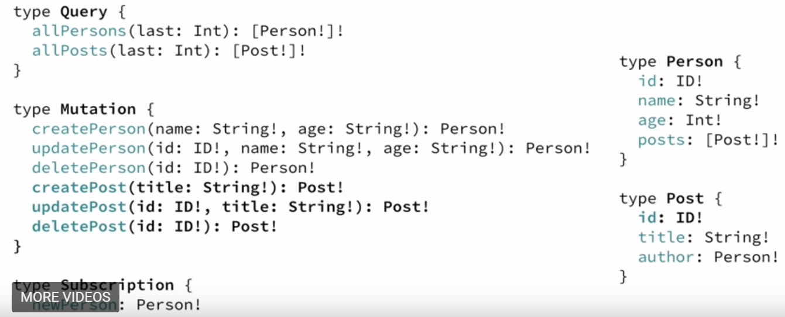
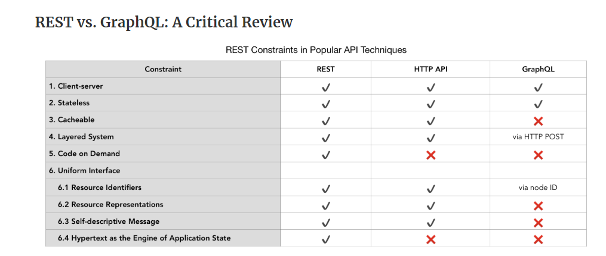
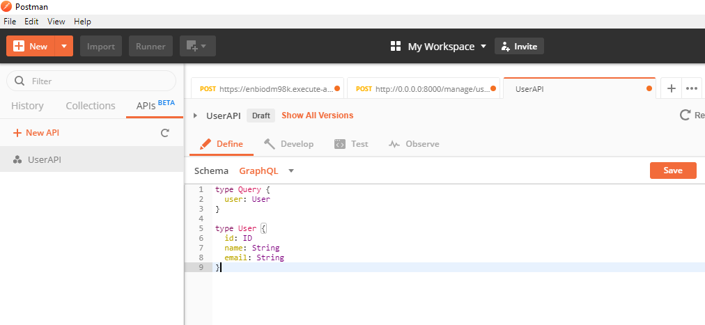
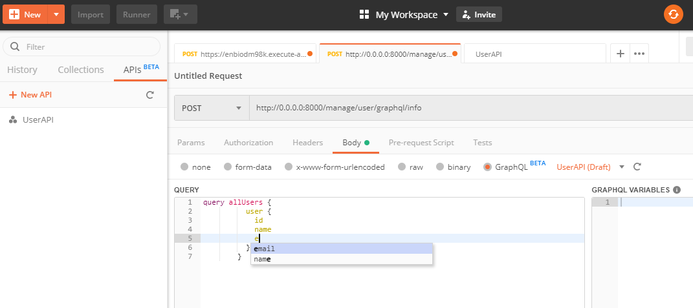
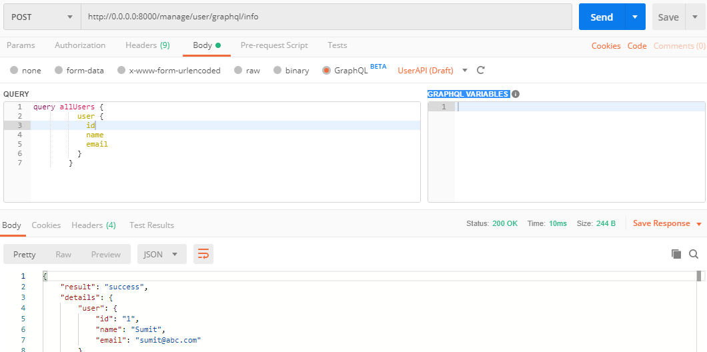

### GraphQL - Do I know about it ?

This is one of the other in "Do I know" - series. Where we would see one of the modern way
to querying the API. 

There are particularly 3 different API architectural technique.
1) Rest.
2) HTTP API.
3) GraphQL 

Possibly most of the developers have already worked on different set of API(s) particularly REST API.
Restful architecture has been the de facto standard for quite sometime now. But over the period of time, many users or developers or architects have started realizing few of the drawbacks.

Few of the Key points would be as per below :

- Problematic while fetching multiple information in one go. It requires multiple API calls.  
- Requires more round trips over network for API calls.
- Not much descriptive while passing request parameter.
- Documenting of an API requires other tool integrations or separate effort.

To overcome all of these problems Facebook introduced and open sourced a new API standard which is called "GraphQL" 

As per definitions : 
"GraphQL is a query language for APIs and a runtime for fulfilling those queries with your existing data. 
GraphQL provides a complete and understandable description of the data in your API, gives clients the power to ask for exactly what they need and nothing more, makes it easier to evolve APIs over time, and enables powerful developer tools."

In short we can think of : "GraphQL is a query language and execution engine tied to any backend service."

Below would be the list of key important items on this :
- Get exactly what you want, because client has options to be specific in terms of query. 
- Client knows what type of information they are about to fetch.
- Lower network overhead and less round trips over network.
- No versioning required you could always keep on appending information.
- Automatic documentation generation.
- Independent developement of client and server code once the schema/contract gets finalized. 

We can understand the entire GraphQL implementations in below phases :

1) Describe your data :

```python
    type Project {
      name: String
      tagline: String
      contributors: [User]
    }

```
2) Ask for what you want :

```python
    {
      project(name: "GraphQL") {
        tagline
      }
    } 
```
3) Get predictable results

```python
    {
      "project": {
        "tagline": "A query language for APIs"
      }
    }
```
There are few basic terminologies which we would require to learn about the GraphQL. 
Fundamental Language Constructs :

- Schema 
    - It considers as contract between client and server.
    - It defines the capabilities of an API, how client fetches and updates API.
    
- Schema Definition Language:    
    ``` python
    
        # Defining Simple Types        
        type BlogPost {
            title: String!                    
        }        
        
        # Adding relation between types.
        # User -> Post 1:M relationship.
        
        type User {
            name: String!
            email: String!
            posts : [BlogPost!]!                        
        }      
        
    ```
- Contract
- Query
    ``` python
        # API endpoint /users/ 
        
        # Fetching all user information only name
        {
            allUsers {
                name                
            }        
        }
        
        # Fetching all user information only name and email
        {
            allUsers {
                name 
                email               
            }        
        }
        
        # Fetching only last 2 user information only name and email
        {
            allUsers(last:2) {
                name 
                email               
            }        
        }
        
        
        # Fetching only last 2 user information only name and email along with post
        {
            allUsers(last:2) {
                name
                 posts {
                    title                    
                }
                email               
            }        
        }
    ```

- Mutations
    - In the GraphQL changes are made through mutations. There are 3 types of mutations available
    - 1) Creating new data.
    
    ```python
    
        mutation {
            createUser(name:"sumit",email: "sumit@abc.com"){
                name
                email
            }
        }
                     
    ``` 
    - 2) updating existing data.
    
    ```python
    
        mutation {
            updateUser(name:"sumit",email: "abc@abc.com"){
                name
                email
            }
        }
                     
    ```     
    - 3) deleting existing data.
    
    ```python
    
        mutation {
            deleteUser(name:"sumit"){
                name            
            }
        }
                     
    ```        
    


- Objects
- Interfaces
- Enums
- Unions
- Scalars

Based on Rest API descriptions and GraphQL definitions, A detailed comparision can be found in here : [https://www.howtographql.com/basics/1-graphql-is-the-better-rest/](https://www.howtographql.com/basics/1-graphql-is-the-better-rest/)

Good comparision between Rest Vs HTTP API Vs GraphQL
----------------------------


If developers want to expose their API as GraphQL. There are different libraries are available in many different languages.
For our example we have python SDK : [https://graphql.org/code/#python](https://graphql.org/code/#python)

In our sample project [https://github.com/sughosneo/graphql-api-demo](https://github.com/sughosneo/graphql-api-demo) we have tried to put together one example which actually helps to understand how we can expose API as GraphQL interface.
In this example we have tried to resolve the query request from the custom object. 

If user wants to interact with GraphQL server through proper interface, there is a dashboard implementation as well for this. 
Which is called as graphiql - [https://github.com/graphql/graphiql/tree/master/packages/graphiql#readme](https://github.com/graphql/graphiql/tree/master/packages/graphiql#readme)
If you are Postman user you can now also set up the GraphQL schema at postman itself. For that check out this article [https://learning.getpostman.com/docs/postman/sending_api_requests/graphql/](https://learning.getpostman.com/docs/postman/sending_api_requests/graphql/) 
Please see below screenshots in terms of the User API schema context.






Here is the request response for the GraphQL API which we have developed as part of sample.



```python
    
    # Below log shows how different component gets parsed and even handled in the server point of view. 
    
    API has been started and listening on http://0.0.0.0:8000/manage/user/graphql/info
    {'query': 'query allUsers {\r\n          user {\r\n            id\r\n            name\r\n            email\r\n          }\r\n        }'}
    query allUsers {
              user {
                id
                name
                email
              }
            }
    userDetails OrderedDict([('user', OrderedDict([('id', '1'), ('name', 'Sumit'), ('email', 'sumit@abc.com')]))])

``` 

If I have to talk about one of the complete adoption of GraphQL -  
then definitely worth talking about Github V4 API [https://developer.github.com/v4/](https://developer.github.com/v4/)

References
-----------------
- [Official Blog] : [https://graphql.org](https://graphql.org)
- [GraphQL Fundamentals] : [https://www.howtographql.com/basics/0-introduction/](https://www.howtographql.com/basics/0-introduction/)
- [Python SDK Library] : [https://graphql.org/code/#python](https://graphql.org/code/#python)
- [Rest Vs GraphQL] : [https://goodapi.co/blog/rest-vs-graphql](https://goodapi.co/blog/rest-vs-graphql)
- [GraphQL In Python World] : [https://www.youtube.com/watch?v=p7VujaALaGQ&t=1323s](https://www.youtube.com/watch?v=p7VujaALaGQ&t=1323s)
- [Github Motivation] : [https://github.blog/2016-09-14-the-github-graphql-api/](https://github.blog/2016-09-14-the-github-graphql-api/)
- [Examples - 1] : [https://github.com/graphql-python/graphene/blob/master/examples/complex_example.py](https://github.com/graphql-python/graphene/blob/master/examples/complex_example.py)
- [Examples - 2] : [https://github.com/alecrasmussen/falcon-graphql-server/blob/master/falcon_graphql_server.py](https://github.com/alecrasmussen/falcon-graphql-server/blob/master/falcon_graphql_server.py)
- [Examples - 3] : [https://github.com/somada141/demo-graphql-sqlalchemy-falcon](https://github.com/somada141/demo-graphql-sqlalchemy-falcon)