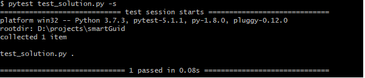
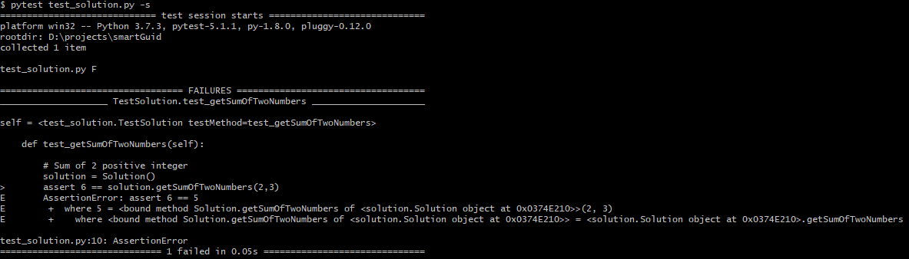
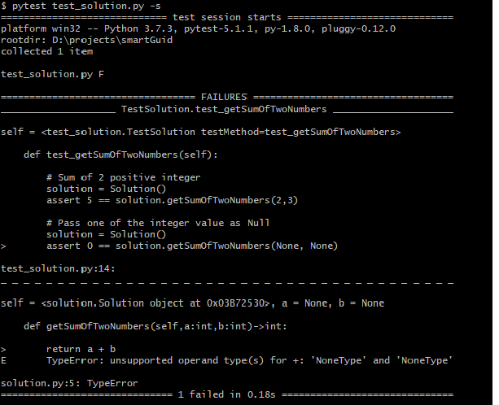
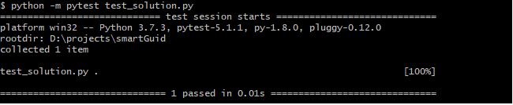

### TDD - Test Driven Development ?

This is one of the other article in "Do I know" series. This is particular on writing proper test cases for any program.
In modern software developement TDD is one of the advanced technique to write quality and bug free applications.
Let's see what's it ? Below are few of the important characteristics :
 
- It's a methodology by which you can assure test case first approach in your project. 
- It's not the replacement of Unit/System/Integration testing. It could be any of the decided approach.
- In this approach before even writing the actual code test cases get written first.Then slowly developer takes "Red"-"Green" refactoring approach to write
    the functionality for the module.
- It's language agnostics. In every language using standard testing framework anyone can follow this methodology.
- Quality of the code definitely gets increased but the overall implementation time of the feature gets increased. 
- It's more like a practice developers/product managers decides to follow it together.
- If developer writes the implementation class/function first then write the unit test case. It can't be considered as TDD approach. 
- Below code be sequence of steps to follow TDD for a programmer :


***For an example :***

Let's say we want to add write a function which would add 2 integers. How can we take TDD approach ?
First we would go ahead and write the test case like as per below :

```python
    
    import unittest

    class TestSolution(unittest.TestCase):
    
        def test_getSumOfTwoNumbers(self):
    
            # Sum of 2 positive integer
            solution = Solution()
            assert 5 == solution.getSumOfTwoNumbers(2,3)
        

```  
- Seeing this we would realize that now we would require to write a ****Solution**** class with a method name 
***getSumOfTwoNumbers()*** which would actually handle the summation of 2 positive integers.
So we have implemented ***Solution*** class and respective method. Please note, user can name the class and method based on their requirement but it's better to keep it same for consistency.

```python

    class Solution:
    
        def getSumOfTwoNumbers(self,a:int,b:int)->int:
    
            return a + b

```
So corresponding to that we have updated the ***test_solution.py*** file as well, incorporating the package ***from solution import Solution***
After that we performed positive and negative testing please see below screenshots.



  

Let's add few more test scenarios. Please see below.

``` python

    import unittest
    from solution import Solution
    
    class TestSolution(unittest.TestCase):
    
        def test_getSumOfTwoNumbers(self):
    
            # Sum of 2 positive integer
            solution = Solution()
            assert 5 == solution.getSumOfTwoNumbers(2,3)
    
            # Pass one of the integer value as Null
            solution = Solution()
            assert 0 == solution.getSumOfTwoNumbers(None, None)
    
            # Pass one of the integer value as Null
            solution = Solution()
            assert 2 == solution.getSumOfTwoNumbers(2, None)
```
Of course these scenarios are not handled in our actual ***Solution*** class under ***getSumOfTwoNumbers()*** method.
And as expected, if we run the test case it fails. 



So now let's try to handle these scenarios in actual implementation and run the test cases again.

```python

    class Solution:

    def getSumOfTwoNumbers(self,a:int,b:int)->int:

        if a is None :
            a = 0

        if b is None:
            b = 0

        return a + b

```
And after running the test cases again all of them gets passed. 



This is iterative process, which keeps on going until feature gets implemented.
 
Recently from the TDD one of the other testing methodology which is getting popular particularly in Agile methodology - which is ***Behavior Driven Development*** [https://en.wikipedia.org/wiki/Behavior-driven_development](https://en.wikipedia.org/wiki/Behavior-driven_development)
- It's an agile software development technique.
- In this methodology developers,product managers,QA,business folks always work together to achieve the same goal in terms of the feature implementations.
BDD is not the scope of this article, we would discuss this in another content.


References
----------------------------
[1] - [TDD] - [https://www.youtube.com/watch?v=T38L7A0xP-c](https://www.youtube.com/watch?v=T38L7A0xP-c)

[2] - [https://www.youtube.com/watch?v=qkblc5WRn-U](https://www.youtube.com/watch?v=qkblc5WRn-U)
 
[3] - [https://www.youtube.com/watch?v=5gMBGVNR8wE](https://www.youtube.com/watch?v=5gMBGVNR8wE)

[4] - [BDD] - [https://medium.com/@TechMagic/get-started-with-behavior-driven-development-ecdca40e827b](https://medium.com/@TechMagic/get-started-with-behavior-driven-development-ecdca40e827b)