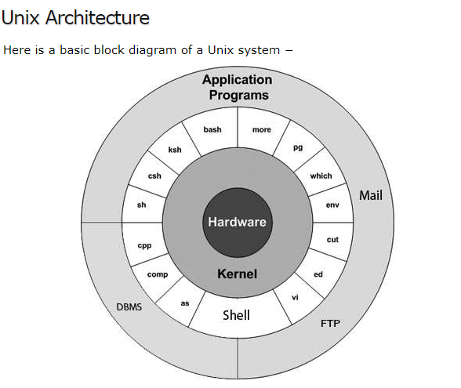

## Do I know shell scripting ?

Though I work with some of the basic unix command everyday. But I always ask myself this question.
If you have the same feeling better you go through below reference and try out some of the basic shell programming of your own.

#### Where shell gets placed in Unix Architecture ?

 

#### Good guide for the beginners :
Ref : https://www.tutorialspoint.com/unix/shell_scripting.htm 

#### Some of the basic theory oriented questions :
Ref : https://www.softwaretestinghelp.com/shell-scripting-interview-questions/

#### And my sample code :

    