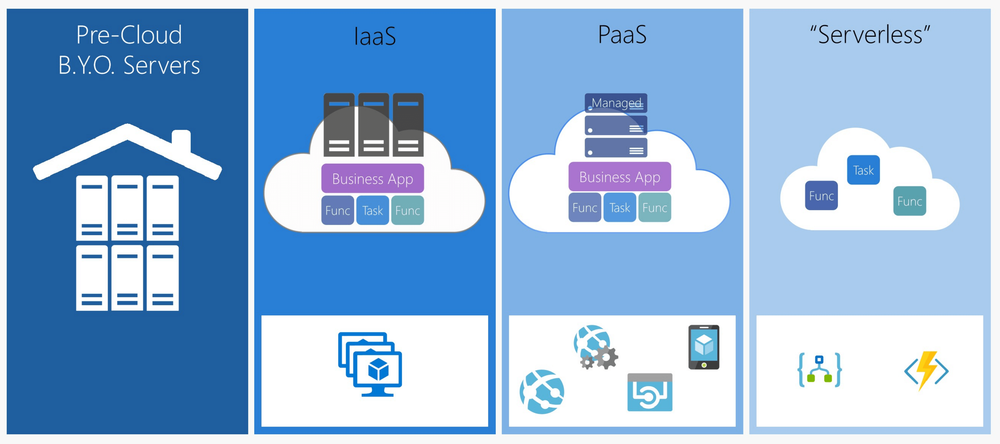
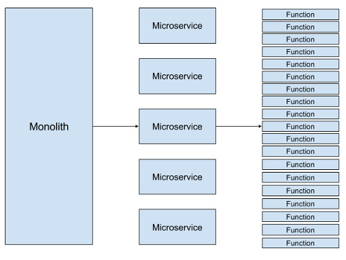

### Faas / Function as a service / Serverless

Recently one of the another software developement model is slowly gaining popularity - Faas or known as Function as a service.
The concept has mainly evolved from serverless. In the world of cloud computing we have are used of Iaas,Paas,Saas and now there is a new concept of ***"Serverless"***
Crux of this entire model is - "Nothing would be running. It would run on demand basis. When it would get called or triggered. 
And user would be charged on that particularly time frame the duration function was running. It's sort like ***pay-per-execution***"

***`Evolution of Faas`*** :

 
 
 Each of the major cloud provider actually started supporting function as a service model. 
 Like - 
 
 AWS Lamda
 Azure Functions
 Cloud Functions
 
There is open source framework [openfaas](https://github.com/openfaas) which actually helps to 
publish and function as a service. It has support for both python and node.js 

References :
 
[1]  http://lukeangel.co/cross-platform/docker-servless-faas-functions-as-a-service/

[2] https://martinfowler.com/articles/serverless.html

[3] https://www.devbridge.com/articles/what-comes-after-microservices-serverless/

[4] https://www.iron.io/what-is-serverless-computing/

[5] https://stackify.com/function-as-a-service-serverless-architecture/ 