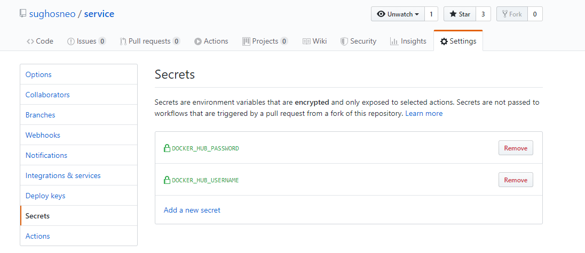
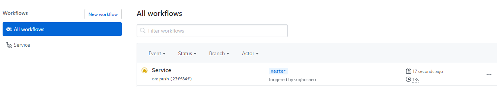
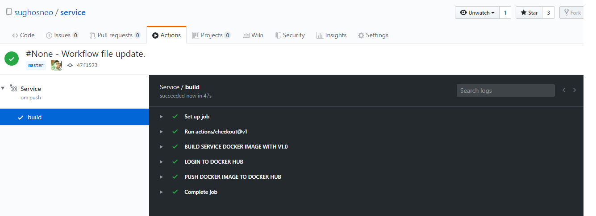
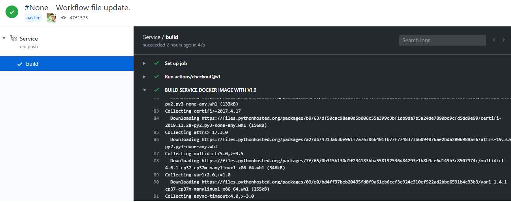
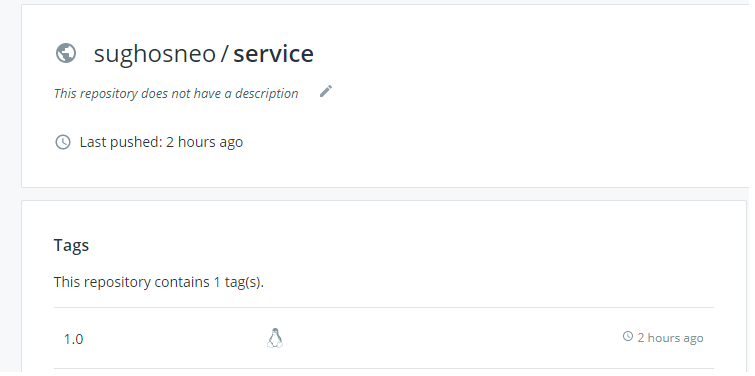
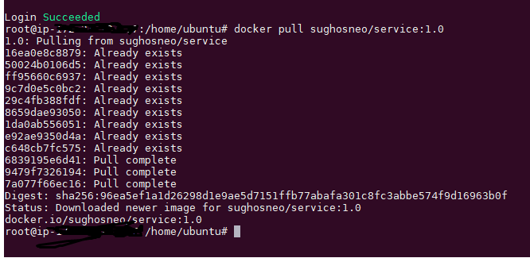
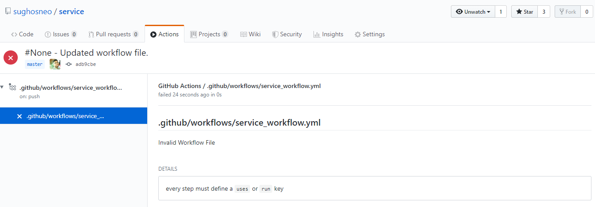
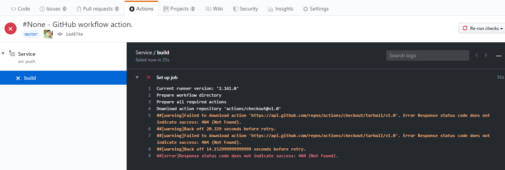

##  GitHub Actions - (In Actions)

In modern software development it's absolutely important for us to finalize right release management process before 
even start developing the feature(s). Particularly if the product follows the SaaS approach.

Some of us are might be familiar with this below CI/CD process.

    ---> Writing Source Code 
    ---> Writing Unit Test Cases 
    ---> Building Docker File
    ---> Building K8s Deployable Yamls      
    ---> Check In the changes to GitHub
    ---> Set up Jenkins Job with proper configuration in place.
    ---> Build Jenkins Job
    ---> Take the build number and refer that to the Jenkins release job
    ---> After that run the jenkins job.
    ---> It would actually run the entire steps into the Jenkins server or build server. 
    ---> Then push the docker image to the docker hub.
    ---> Deploy the changes in the actual deployable machine with version number.    

Few of the basics can be read from here as well : [https://github.com/sughosneo/blogs/blob/master/devops_basics.md](https://github.com/sughosneo/blogs/blob/master/devops_basics.md)
Now think about the scenario instead of doing so much wouldn't that be better if your source code version control system would have similar functionality already available inbuilt. 
Wouldn't that be awesome ? Yes, that's where GitHub Actions comes ***```"IN ACTION"```***.

Let's see how can we make use of it ? To start with you we would require to understand few of the basics. Something like  
 
1) Understanding what workflow we would like to set up for each code base. 
2) Workflow YAML definitions writing based on steps required to be written.
3) Defining different secrets which needs to be configured as part of environment variable.
4) Configuring the workflow based on the different phases - like code "on push" or "on pull" etc..
5) Validating the workflows after checking in the GitHub.
6) Letting the action run and debug if necessary.   

Enough of talking, let's see few of the steps in action. 

Below is the workflow yaml for one of my simple service deployment.

```yaml

        name: Service

        on: [push]
        
        jobs:
        
          build:
        
            runs-on: ubuntu-latest
        
            steps:
            - uses: actions/checkout@v1
            - name: BUILD SERVICE DOCKER IMAGE WITH V1.0
              run: docker build . --file Dockerfile --tag ${{ secrets.DOCKER_HUB_USERNAME }}/service:1.0
            - name: LOGIN TO DOCKER HUB
              run: docker login --username ${{ secrets.DOCKER_HUB_USERNAME }} --password ${{ secrets.DOCKER_HUB_PASSWORD }}
            - name: PUSH DOCKER IMAGE TO DOCKER HUB
              run : docker push ${{ secrets.DOCKER_HUB_USERNAME }}/service:1.0
        
``` 
Above workflow steps are pretty self explanatory and we have picked up a simple example. But there could be complex workflows as well.
If you notice there are 2 environment variables which could be configured under secrets. like below :



It's also mentioned in the workflow yaml job would get executed ***"on push"***. That means,as soon as you would push any new changes GitHub Actions would start getting built.
As you can see it's already in the running state. It's not only for the workflow yaml update any code or configuration push in the GitHub repo would actually end up triggering GitHub actions.  



After a successful run of the Workflow job completion status would something like below.



If user wants to see some more details they can also drill down one particular job step and explore more about individual details. 



Once the job got finished and successful, as expected the ***sughosneo/service:1.0*** docker image is present in the docker hub.



You can also see from below image we are able to pull the image in a different server as well.



So far so good. But as a developer they are always been few questions comes to mind. So let's see few of the popular ***Q&A***  

***Q 1)*** How would I validate if I am writing correct workflow file or not ? Or how would I validate these workflow file ?
Once you check your workflow yaml file changes in your GitHub repo under ```.git``` folder you would notice the error if your worflow file is not valid.
Like the scenario below.



***Q 2)*** During the workflow job run how would I check the errors ? 
You can check that out once you run the actual jobs. Please see below example.



References 
-----------------

[1] - [https://help.github.com/en/actions/automating-your-workflow-with-github-actions](https://help.github.com/en/actions/automating-your-workflow-with-github-actions)


