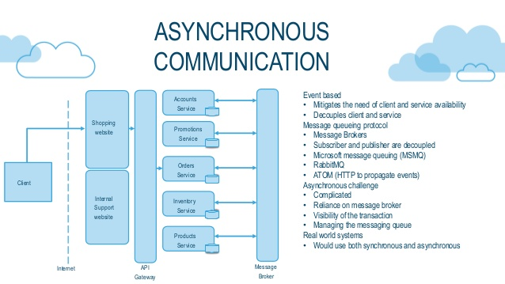
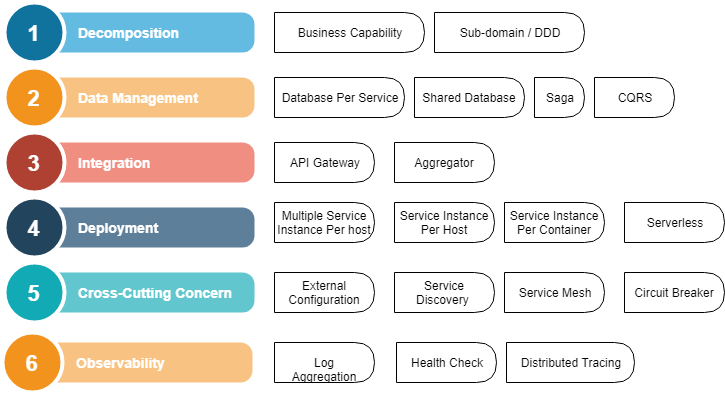

### Microservices and it's Design Pattern

This article primary focuses on different design pattern industry has been practicing in their ***Microservices*** related
architecture or deployment. Before getting into the details let's first see what are important points we already know about microservices.

***```Definitions :```***

As per Wikipedia deifinition [https://en.wikipedia.org/wiki/Microservices](https://en.wikipedia.org/wiki/Microservices) :

" Microservices are a software development technique — a variant of the service-oriented architecture (SOA) architectural style that structures 
an application as a collection of loosely coupled services. In a microservices architecture, services are fine-grained and the protocols are lightweight. 
The benefit of decomposing an application into different smaller services is that it improves modularity. 
This makes the application easier to understand, develop, test, and become more resilient to architecture erosion.[2] It parallelizes development by enabling small autonomous teams to develop, deploy and scale their respective services independently.
It also allows the architecture of an individual service to emerge through continuous refactoring. Microservice-based architectures enable continuous delivery and deployment. "


***```Monolithic Vs Microservices Architecture :```***


Source : [https://www.bmc.com/blogs/microservices-architecture/](https://www.bmc.com/blogs/microservices-architecture/)

***```Design Principles Of A Microservice``` :***

While designing a microservice we should keep following principles in mind.

-  Should be ```Highly Cohesive```
-  Should be performing ```Autonomous``` operation
-  Should be ```Business Domain``` Centric
-  Should be ```Resilient```
-  Can be easily ```Monitored```, preferably centralized fashion
-  Can be deployed with ```Automatically```.

***```Communication Mechanism Of Microservice(s)``` :***

There are mainly 2 ways microservices talk to each other - ***1) Synchronous Communication*** Or ***2) Asynchronous Communication***  
1) Sync :

    - In this scenario a microservice directly makes a call to another microservice in synchronous way.
    - Both the services needs to be available to reach to a state for any of the transaction either success or failure.
    - It's easy to adopt and implement.  
    
            
    
    Source : https://microservices.io
    
2) Async :
    
    - In this scenario both or many microserices talks to each other through a message broker.
    - Popular and ideal implementation where none of the parties need to be available during a transaction. 
    - It uses basic Pub/Sub event driven model to do the communications.
    - Implementation could be tricky.
    
    


Now, coming back to our actual topic of Design Patterns of Microservices. There are quite a number of patterns are available and are evolving as well. 
Based on the usage and popularity here are few of the important ones as list.
   
   
   


Each of the pattern actually tries to answer specific set of problem designing microservices and it's solution.
Let's see the few of the important ones. Detailed solution can be read in below reference articles.


```Pattern: Decompose by business capability``` : How to decompose an application into services?

```Pattern: Circuit Breaker``` : How to prevent a network or service failure from cascading to other services?
    
```Pattern: Database per service```: What’s the database architecture in a microservices application?

```Pattern: Saga```: How to maintain data consistency across services?

```Pattern: Command Query Responsibility Segregation (CQRS)``` : How to implement a query that retrieves data from multiple services in a microservice architecture?

```Pattern: Log aggregation```: How to understand the behavior of an application and troubleshoot problems?

etc..


References
---------------------
[1] - [https://microservices.io/](https://microservices.io/)

[2] - [https://martinfowler.com/articles/microservices.html](https://martinfowler.com/articles/microservices.html)

[3] - [https://www.slideshare.net/AmazonWebServices/introduction-to-microservices-66320469](https://www.slideshare.net/AmazonWebServices/introduction-to-microservices-66320469)

[4] - [https://www.slideshare.net/AmazonWebServices/architecture-microservices](https://www.slideshare.net/AmazonWebServices/architecture-microservices)

[5] - [https://dzone.com/articles/patterns-for-microservices-sync-vs-async](https://dzone.com/articles/patterns-for-microservices-sync-vs-async)

[6] - [https://dzone.com/articles/microservices-in-the-cloud-part-one](https://dzone.com/articles/microservices-in-the-cloud-part-one)