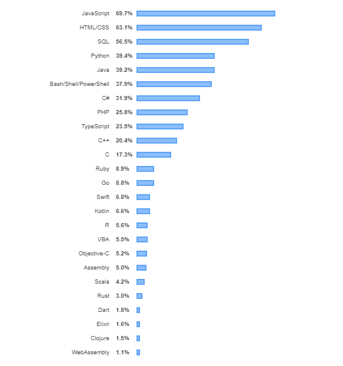

### Python - Vs - Golang - Vs - NodeJs


Source : Internet

In this article we would look into different aspects of these popular technologies or language or frameworks.
It would be more a like a comparative study in terms of different artifacts or usage or popular choices.  

1) ***By Definition*** - Few times actually we get confused between the frameworks or technology or specific programming language. Let's clear the air first.

    ***```Python :```*** 
    - It's a programming language.
        
    ***```Go :```*** 
    - It's a programming language.
    
    ***```NodeJs :```*** 
    - It's not a programming language. JS or Javascript is the programming language. It's just a framework or runtime for executing javascript.

2) ***By Popularity*** - Though Java stays most popular primary programming language in different developer surveys but Python or GoLang or Node.js has it's own popular definitions.

   According to "jetbrains" dev ecosystem survey, 
   
   ***```Python :```*** : 
   - Most studied language.
        
   ***```Go :```*** 
   - The most promising programming language.
    
   ***```NodeJs :```*** 
   - Though it doesn't talk about any specific NodeJs framework but definitely it says Javascript is basically "The most used overall programming language"
        With gaining popularity of this framework you don't need to guess that it could be one of the used runtime.


   Source : [https://www.jetbrains.com/lp/devecosystem-2019/](https://www.jetbrains.com/lp/devecosystem-2019/)
    
   Let's look into other popular survey result like Stackoverflow 2019 developer survey.
   Based on that this is quite evident above story seems to be more or less right at least in terms of selected language.  
   
   
   
   Source : [https://insights.stackoverflow.com/survey/2019#most-popular-technologies](https://insights.stackoverflow.com/survey/2019#most-popular-technologies)
   
3) ***By History*** - It's always interesting to look back and understand the motivation or thought process which might have gone behind to develop one particular 
    language or technologies or framework. 
    
    ***```Python :```*** :              
       
    - Python was developed in the late 1980s by Guido van Rossum in the Netherlands as a successor to the ABC language.
    - But officially it was released in 1991.
    - There was a need of a language which would be object oriented and easy to read,write or maintain.
    
    ***```Go :```*** 
    
    - It was designed at Google by Robert Griesemer, Rob Pike, and Ken Thompson.
    - For many of the concurrent operation there was a need of fast language which was required to be designed itself as concurrent. 
        
    ***```NodeJs :```***
    
    - In 2010 it was written by Ryan Dahl.
    - With this effort Original goal was to run the Javascript code outside of the browser engine. 
    - To do so Chrome V8 engine was extracted out separately and wrapped up with a framework which is nothing but the NodeJs framework or runtime for javascript.
     
4) ***By Architecture*** - Every programming language has it's own architecture model so a framework too.

    
        
    Source : Internet
    
    
    
    Source : Stackoverflow blog.    
    
    

5) ***By Characteristic*** - 
    
    There could be different many features or characteristic what we could compare and look at it.

     
    
6) ***Best Fit In*** -

    ***```Python :```*** :
    
    - For a quick, clean, modular development it might be a great fit.
    - Easy adoption for any new members to get going. 
    - When there would be a CPU intensive operation python could be a good fit.
    - Backend webservices or API development along with scripting.
    - Popular in machine learning or AI ecosystem - where backend could be developed using python.  
        
    ***```Go :```*** 
    
    - If it's a CPU and memory bound task Go language seems to be a better options.
    - Fast concurrent or parallel task or workload needs to be completed.
    - Popular uses in web-services or cron-job, repetitive task.
    - Different set of scripting applications.
    
    ***```NodeJs :```***
     
    - Being it's async nature it's useful when we would require to build fast,scalable network applications.
    - If it's required to create API where multiple concurrent connections need to be handled.
    - If there would be lot of events needs to be responded with different actions - nodeJs api(s) callback can easily be implemented.
    - Building api(s) or webservices as backend component.
    - Chat related applications.               

7) ***Might not be "Best Fit In"*** -

    ***```Python :```*** : 
    
   - Where might be lot of asynchronous request needs to be methodologies need to be adopted. Python might not be the first choice There are ways using different libraries but by default
   - Though with standard libraries multiprocessing can be achieved using standard libraries but still if there is a scenario where
     concurrency or parallelism needs to be used, python might not be a good fit. 
              
    ***```Go :```***
    
    - Where there could be lot of complicated data structures needs to be dealt with then Go might not the first choice.
      because as it's simple language complex types need to be writen from scratch.
    - Where there would ba ecosystem GUI needs to be created Go has very less library support.
    
    ***```NodeJs :```***
    
    - A web applications with relation database behind.
    - A heavy server side processing particularly CPU intensive operations.

8) ***Quick Benchmarking on "Binary Tree Operations"*** - 
    
    
    
    Source : https://benchmarksgame-team.pages.debian.net/benchmarksgame/fastest/node-python3.html

It's to be noted, there could be many points which someone has to consider before making a choice of picking up a language for any applications or services.
Though standard architecture pattern could easily get fit for specific scenarios but in terms of programming languages that's a very hard decisions to make. There could be a lot of trade-offs which needs to be evaluated
before picking up the right choice particularly for the new applications. For the existing applications or services it might be little easy the reason either in that scenario we are trying to extend the feature where roadblock is already known or
we are replacing it with a possible solutions.
 
 
References
--------------------------------------
- https://en.wikipedia.org/wiki/Python_(programming_language)
- https://en.wikipedia.org/wiki/Go_(programming_language)
- https://en.wikipedia.org/wiki/Node.js
- https://medium.com/@blogger.ashishsharma/golang-vs-node-js-comparison-and-why-developers-prefer-node-js-9e669319df52
- https://medium.com/@hatajoe/clean-architecture-in-go-4030f11ec1b1
- https://stackoverflow.com/questions/36766696/which-is-correct-node-js-architecture
- http://web.archive.org/web/20170208132221/https://arenli.com/architecture-of-node-js-internal-codebase-57cd8376b71f?gi=1984716e61d6
- https://dev.to/deepu105/my-reflections-on-golang-38jk
- https://www.toptal.com/nodejs/why-the-hell-would-i-use-node-js